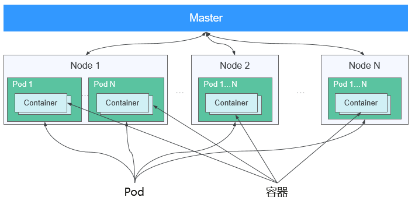

# Pod

`Pod` 是 `k8s` 最重要的基本概念，组成示意图如下所示：

每个 `Pod` 都有一个特殊的被称为**根容器**的 `Pause` 容器。 `Pause` 容器对应的镜像属于 `k8s` 平台的一部分，除了 `Pause` 容器，每个 `Pod` 还包含一个或多个紧密相关的**用户业务容器**。

`k8s` 为每个 `Pod` 都分配了**唯一**的 `IP` 地址，称之为 `Pod IP` ，一个 `Pod` 里的多个容器**共享** `Pod IP` 地址。

`k8s` 要求底层网络支持集群内**任意**两个 `Pod` 之间的 `TCP/IP` 直接通信，这通常采用**虚拟二层网络技术**来实现，例如 `Flannel` 、 `Open vSwitch` 等，因此需要牢记一点：**在k8s里，一个Pod里的容器与另外主机上的Pod容器能够直接通信**。

## Pod类型

### 普通Pod

**普通的Pod**一旦被创建，就会被放入 `etcd` 中存储，随后会被 `k8s Master` 调度到某个具体的 `Node` 上并进行**绑定**（ `Binding` ），随后该 `Pod` 被对应的 `Node` 上的 `kubectl` 进程实例化成一组相关的 `Docker` 容器并启动。

### 静态Pod

**静态Pod**比较特殊，它并没有被存放在 `k8s` 的 `etcd` 存储里，而是被存放在某个具体的 `Node` 上的一个**具体文件**中，并且**只在**此 `Node` 上启动、运行。

## Pod、容器与Node的关系

在默认情况下，当 `Pod` 里的某个容器停止时， `k8s` 会自动检测到这个问题并且**重新启动**这个 `Pod` （重启 `Pod` 里的所有容器），如果 `Pod` 所在的 `Node` 宕机，就会将这个 `Node` 上的所有 `Pod` 重新**调度**到其他节点上。

