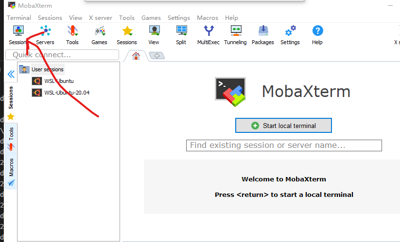
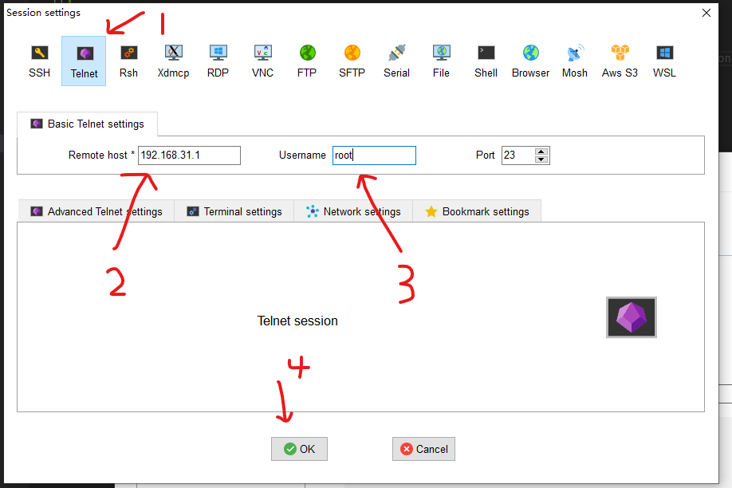
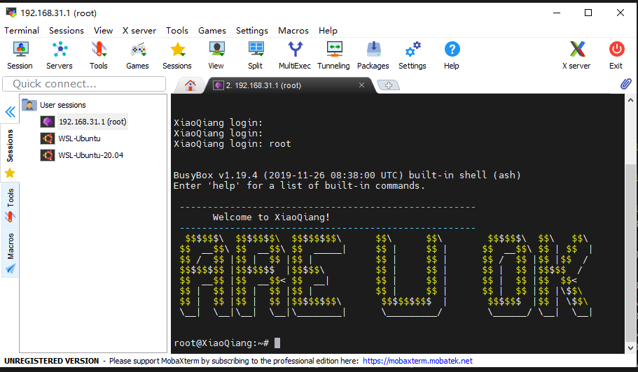
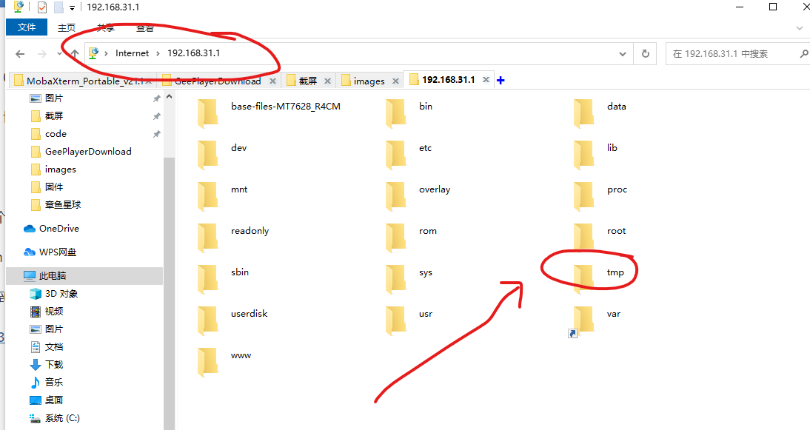
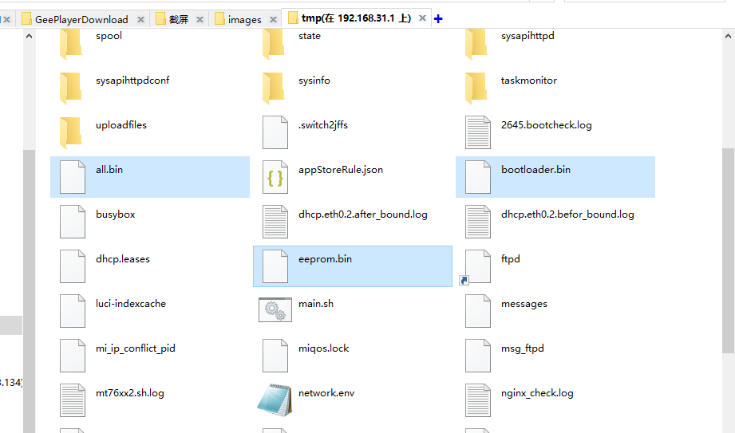
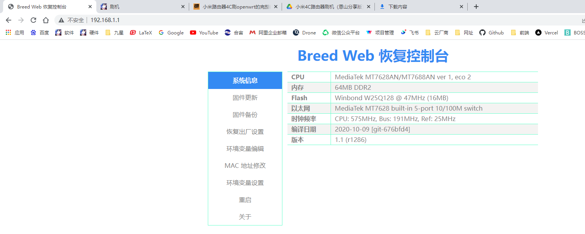
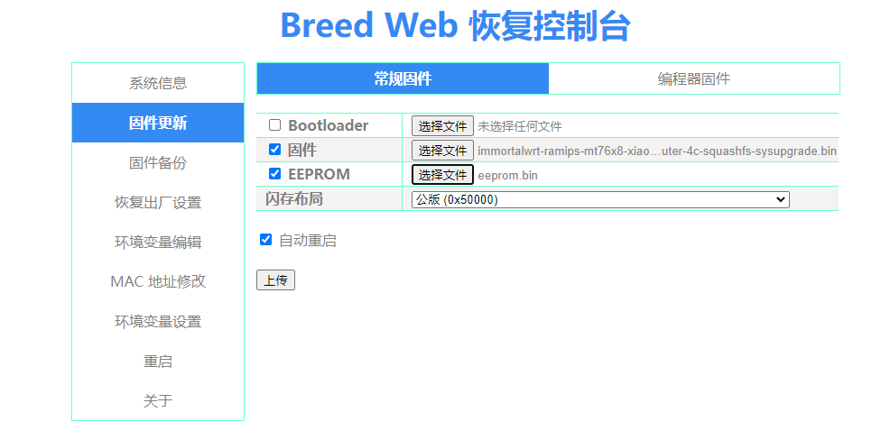
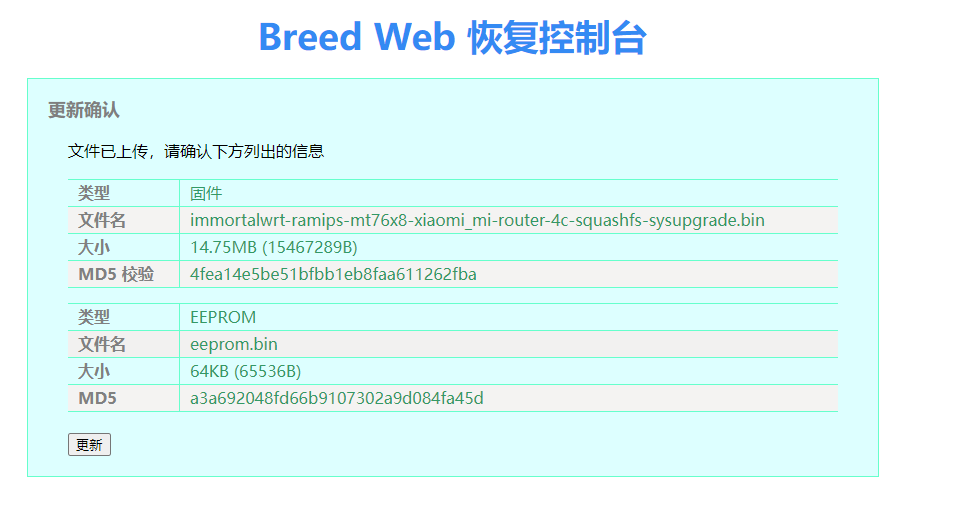
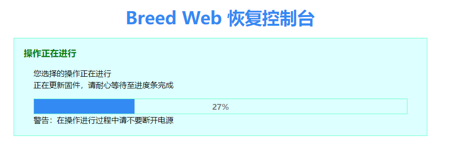
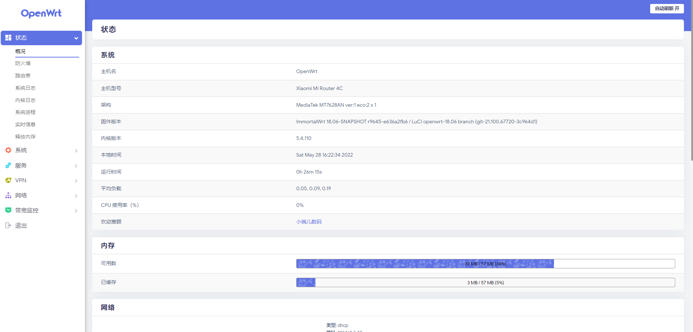

# 刷机
* [参考教程](https://www.right.com.cn/forum/thread-4126914-1-1.html)

## 环境准备

路由器需要保证 `ip` 地址为 `192.168.31.1`

**附件下载**

* [R3GV2 patches.rar](https://megrez-file.virtualbing.fun/%E6%8A%98%E8%85%BE/%E5%B0%8F%E7%B1%B3%E8%B7%AF%E7%94%B1%E5%99%A84C/%E5%88%B7%E6%9C%BA/R3GV2%20patches.rar)
* [MobaXterm_Portable_v21.1.zip](https://megrez-file.virtualbing.fun/%E6%8A%98%E8%85%BE/%E5%B0%8F%E7%B1%B3%E8%B7%AF%E7%94%B1%E5%99%A84C/%E5%88%B7%E6%9C%BA/MobaXterm_Portable_v21.1.zip)
* [breed-mt7688-reset38.bin](https://megrez-file.virtualbing.fun/%E6%8A%98%E8%85%BE/%E5%B0%8F%E7%B1%B3%E8%B7%AF%E7%94%B1%E5%99%A84C/%E5%88%B7%E6%9C%BA/breed-mt7688-reset38.bin)
* [immortalwrt-ramips-mt76x8-xiaomi_mi-router-4c-squashfs-sysupgrade.bin](https://megrez-file.virtualbing.fun/%E6%8A%98%E8%85%BE/%E5%B0%8F%E7%B1%B3%E8%B7%AF%E7%94%B1%E5%99%A84C/%E5%88%B7%E6%9C%BA/immortalwrt-ramips-mt76x8-xiaomi_mi-router-4c-squashfs-sysupgrade.bin)
* [eeprom.bin](https://megrez-file.virtualbing.fun/%E6%8A%98%E8%85%BE/%E5%B0%8F%E7%B1%B3%E8%B7%AF%E7%94%B1%E5%99%A84C/%E5%88%B7%E6%9C%BA/eeprom.bin)
* [bootloader.bin](https://megrez-file.virtualbing.fun/%E6%8A%98%E8%85%BE/%E5%B0%8F%E7%B1%B3%E8%B7%AF%E7%94%B1%E5%99%A84C/%E5%88%B7%E6%9C%BA/bootloader.bin)

## Step1 破解权限

解压下载好的 `R3GV2 patches.rar` 文件，以**管理员身份**运行里面的 `0.start_main.bat` 文件。

## Step2 进入路由器系统

解压下载好的 `MobaXterm_Portable_v21.1.zip` 文件，运行 `MobaXterm_Personal_21.1.exe` 程序，接下来新建 `session` ，如下所示：



点击 `Session` 按钮后会弹出来 `Session` 配置页面，我们建立 `Telnet` 协议的 `Session` ，主机地址填写路由器的ip： `192.168.31.1` ，用户名填入 `root` ，之后点击 `ok` ，如下所示：



接下来就会自动进入此 `Session` ，输入 `root` 即可进入，如下所示：



> [!tip]
> 遇到 `ARE U OK` 是否感到很亲切！

## Step3 分区备份

### 查看分区情况

首先查看各个分区情况：

```bash
$  cat /proc/mtd
dev:    size   erasesize  name
mtd0: 01000000 00010000 "ALL"
mtd1: 00020000 00010000 "Bootloader"
mtd2: 00010000 00010000 "Config"
mtd3: 00010000 00010000 "Factory"
mtd4: 00010000 00010000 "crash"
mtd5: 00010000 00010000 "cfg_bak"
mtd6: 00100000 00010000 "overlay"
mtd7: 00c60000 00010000 "OS1"
mtd8: 00af0000 00010000 "rootfs"
mtd9: 00200000 00010000 "disk"
```

### 备份ALL

```bash
$ dd if=/dev/mtd0 of=/tmp/all.bin
32768+0 records in
32768+0 records out

# 查看备份结果
$ ls -la /tmp/ | grep all.bin
-rw-r--r--    1 root     root      16777216 May 28 15:17 all.bin
```

### 备份Bootloader

```bash
$ dd if=/dev/mtd1 of=/tmp/bootloader.bin
256+0 records in
256+0 records out

# 查看备份结果
$ ls -la /tmp/ | grep bootloader.bin
-rw-r--r--    1 root     root        131072 May 28 15:20 bootloader.bin
```

### 备份Factory

```bash
$ dd if=/dev/mtd3 of=/tmp/eeprom.bin
128+0 records in
128+0 records out

# 查看备份结果
$ ls -la /tmp/ | grep eeprom.bin
-rw-r--r--    1 root     root         65536 May 28 15:23 eeprom.bin
```

### 导出备份

打开**文件资源管理器**，输入 `ftp://192.168.31.1` ，进入小米路由器的 `ftp` 文件系统中，如下所示：



进入 `tmp` 文件夹中，找到我们刚刚备份的 `all.bin` 、 `bootloader.bin` 和 `eeprom.bin` 三个文件，拷贝出来。



> [!warning|label: 注意]
> `eeprom.bin` 的大小应该是 `64K` ， `bootloader.bin` 的大小应该是 `128K` ，我这里备份之后显示只有 `1K` ，不对，但是这种固件网上有的是，我就没有管它，直接用的网上下载的。

## Step4 刷入Breed

将下载好的 `breed-mt7688-reset38.bin` 固件改名 `为breed.bin` ，并拷贝到小米路由器中的 `tmp` 文件夹内，如下所示：

```bash
$ ls -la /tmp/ | grep breed.bin
-rw-r--r--    1 root     root         91141 May 28 15:35 breed.bin
```

刷入 `Breed` ：

```bash
$ mtd write /tmp/breed.bin Bootloader
Unlocking Bootloader ...

Writing from /tmp/breed.bin to Bootloader ...
```

## Step5 重启

刷入完成后将小米路由器**断电**，按住**复位键**的**同时**通电，可以看到**电源灯与网络灯闪烁几下**后即可**松开**复位键，此时就进入了 `Breed` 模式。

## Step6 Breed配置

浏览器输入 `192.168.1.1` 进入 `Breed` 配置页面，如下所示：



接下来选择左侧菜单栏中的固件更新功能，固件选择我们下载的固件， `EEPROM` 选择我们备份的，如果备份后的大小不对，那就去上面的连接下载。



点击**上传**就会进入信息确认解密，如下所示：



接下来点击**更新**按钮，就开始刷机了：



耐心等待刷机完成后的重启。

## Step7 完成

重启后如果没有问题，应该就是刷机完成了。打开浏览器，输入 `192.168.5.1` ，进入系统配置页面：


用户名是 `root` ，密码是 `password` ，进入系统，如下所示：


