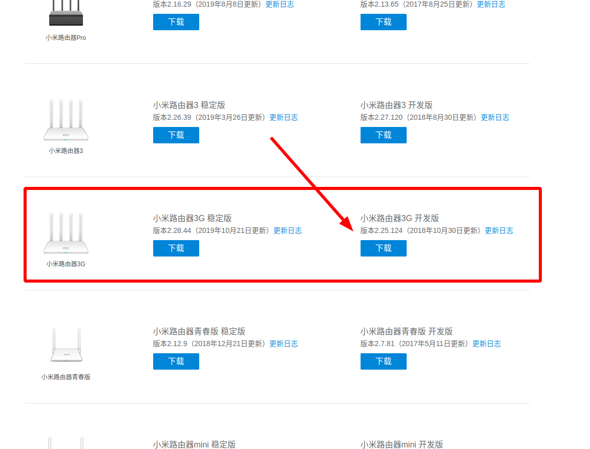
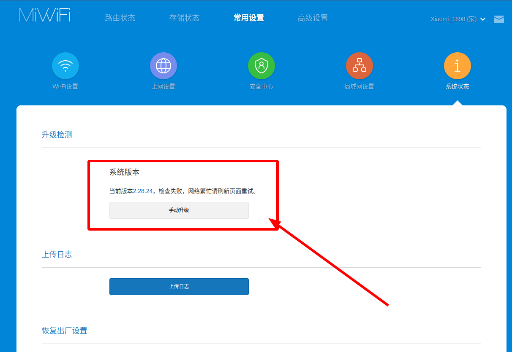
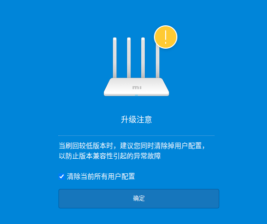
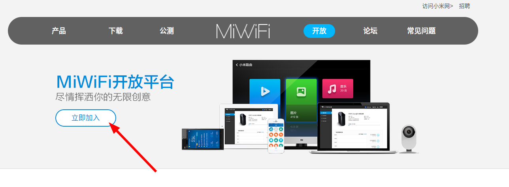
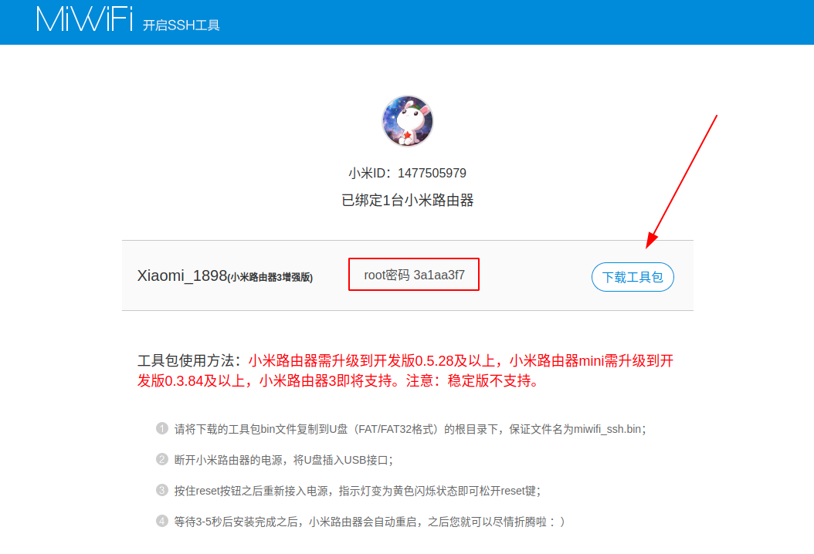
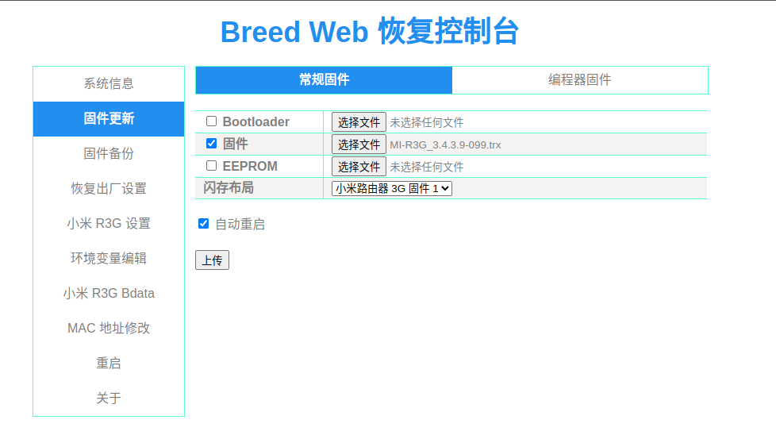

# 刷机

> [!tip|label: 提示]
> 密码： `3a1aa3f7`

## 参考文章

* https://www.bilibili.com/read/mobile?id=12383715    （推荐）
* https://www.right.com.cn/forum/thread-8203564-1-1.html

## Step1. 刷入开发版固件

打开[官方下载网页](http://miwifi.com/miwifi_download.html)，点击 `下载` ——> `ROM` ，找到小米路由器3G，下载开发版固件，如下所示：





> [!tip|label: 提示]
> 由于此固件已经停止更新，为了避免后续在官网上下架，在此备份了最新的一版——[miwifi_r3g_firmware_12f97_2.25.124.bin](https://megrez-file.virtualbing.fun/%E6%8A%98%E8%85%BE%2F%E5%B0%8F%E7%B1%B3%E8%B7%AF%E7%94%B1%E5%99%A8R3G%2F%E5%88%B7%E6%9C%BA%2Fmiwifi_r3g_firmware_12f97_2.25.124.bin)

接下来进入路由器管理页面，进入**常用设置**——> **系统状态**页面，选择**手动升级**，上传刚刚下载的升级包即可，如下所示：





因为最新的稳定版本是 `2.28` 的，我们相当于降版本了，因此会有如下提示：





## Step2. 开启SSH功能

上一步刷完开发版本固件之后，相当于刷机了，重启路由器后我们通过 `192.168.31.1` 进入路由器配置页面，并下载手机端 `APP` ，使用小米账号登录（没有就创建一个），然后手机连接路由器 `wifi` ，打开小米 `WiFi` 路由器就会提示绑定设备了。

接下来进入[官方开放网页](http://miwifi.com/miwifi_open.html)，点击开放，先点击**立即加入**，登录小米账号，如下所示：





登录小米账号之后点击**开启SSH工具**按钮，就会检查绑定到此账号下的路由器设备，如果没有，就无法下载 `ssh` 工具，下载页面如下所示：





记住 `root` 密码。下载好的文件：<a href="折腾/小米路由器R3G/刷机/assets/files/miwifi_ssh.bin" download="miwifi_ssh.bin">miwifi_ssh.bin</a>

> [!tip|label: 提示]
> `ssh` 工具下载会遇到一个错误： `Mixed Content: The site at 'https://d.miwifi.com/' was loaded over a secure connection, but the file at 'https://d.miwifi.com/rom/ssh/download?sn=15757%2F30048427&userId=1477505979' was redirected through an insecure connection. This file should be served over HTTPS. This download has been blocked. See https://blog.chromium.org/2020/02/protecting-users-from-insecure.html for more details.` 我们手动点击下载连接下载即可。

接下来找一个**U盘**，最好格式化成 `FAT/FAT32` 格式，之后将下载下来的<a href="折腾/小米路由器R3G/刷机/assets/files/miwifi_ssh.bin" download="miwifi_ssh.bin">miwifi_ssh.bin</a>文件放到U盘的**根目录**，并保证名称仍然是<a href="折腾/小米路由器R3G/刷机/assets/files/miwifi_ssh.bin" download="miwifi_ssh.bin">miwifi_ssh.bin</a>。

接下来按照官网上说的方式，断电，插入U盘，按照Reset键，通电，开机，直到指示灯变为**黄色闪烁状态**松开 `reset` 键，等待重新开机即可。（官网说3-5秒，实际上得有两分钟）。

等待路由器重启过后就可以使用ssh连过去了。

> [!tip|label: 提示]
> `Ubuntu 20.04` 使用 `ssh` 连接会提示 `Unable to negotiate with 192.168.31.1 port 22: no matching key exchange method found. Their offer: diffie-hellman-group1-sha1,diffie-hellman-group14-sha1` 错误，解决方式是命令增加 `-oKexAlgorithms=+diffie-hellman-group1-sha1` 标记。

连接示例：

```bash
$ ssh -oKexAlgorithms=+diffie-hellman-group1-sha1 root@192.168.31.1
The authenticity of host '192.168.31.1 (192.168.31.1)' can't be established.
RSA key fingerprint is SHA256:jUhVBMF1wgQ1qe5nXgErfPvm5F6otJE7a1xyds8obSo.
Are you sure you want to continue connecting (yes/no/[fingerprint])? yes
Warning: Permanently added '192.168.31.1' (RSA) to the list of known hosts.
root@192.168.31.1's password: 

BusyBox v1.19.4 (2018-10-29 07:52:03 UTC) built-in shell (ash)
Enter 'help' for a list of built-in commands.

 -----------------------------------------------------
       Welcome to XiaoQiang!
 -----------------------------------------------------
  $$$$$$\  $$$$$$$\  $$$$$$$$\      $$\      $$\        $$$$$$\  $$\   $$\
 $$  __$$\ $$  __$$\ $$  _____|     $$ |     $$ |      $$  __$$\ $$ | $$  |
 $$ /  $$ |$$ |  $$ |$$ |           $$ |     $$ |      $$ /  $$ |$$ |$$  /
 $$$$$$$$ |$$$$$$$  |$$$$$\         $$ |     $$ |      $$ |  $$ |$$$$$  /
 $$  __$$ |$$  __$$< $$  __|        $$ |     $$ |      $$ |  $$ |$$  $$<
 $$ |  $$ |$$ |  $$ |$$ |           $$ |     $$ |      $$ |  $$ |$$ |\$$\
 $$ |  $$ |$$ |  $$ |$$$$$$$$\       $$$$$$$$$  |       $$$$$$  |$$ | \$$\
 \__|  \__|\__|  \__|\________|      \_________/        \______/ \__|  \__|

root@XiaoQiang:~# 
```

## Step3. 分区备份

首先查看各个分区情况：

```bash
$ cat /proc/mtd
dev:    size   erasesize  name
mtd0: 07f80000 00020000 "ALL"
mtd1: 00080000 00020000 "Bootloader"
mtd2: 00040000 00020000 "Config"
mtd3: 00040000 00020000 "Bdata"
mtd4: 00040000 00020000 "Factory"
mtd5: 00040000 00020000 "crash"
mtd6: 00040000 00020000 "crash_syslog"
mtd7: 00040000 00020000 "reserved0"
mtd8: 00400000 00020000 "kernel0"
mtd9: 00400000 00020000 "kernel1"
mtd10: 02000000 00020000 "rootfs0"
mtd11: 02000000 00020000 "rootfs1"
mtd12: 03580000 00020000 "overlay"
mtd13: 012a6000 0001f000 "ubi_rootfs"
mtd14: 030ec000 0001f000 "data"
```

导出重要的分区

```bash
$ dd if=/dev/mtd1 of=/tmp/Bootloader.bin
$ dd if=/dev/mtd2 of=/tmp/Config.bin
$ dd if=/dev/mtd4 of=/tmp/Factory.bin
```

* <a href="折腾/小米路由器R3G/刷机/assets/files/Bootloader.bin" download="Bootloader.bin">Bootloader.bin</a>
* <a href="折腾/小米路由器R3G/刷机/assets/files/Config.bin" download="Config.bin">Config.bin</a>
* <a href="折腾/小米路由器R3G/刷机/assets/files/Factory.bin" download="Factory.bin">Factory.bin</a>

## Step4. 输入breed控制台

从 `https://breed.hackpascal.net` 下载 `xiaomi-r3g` 的版本，[breed-mt7621-xiaomi-r3g.bin](https://breed.hackpascal.net/breed-mt7621-xiaomi-r3g.bin)

> [!tip|label: 提示]
> 因为 `breed` 作者似乎不更新这个项目了，这个项目又是**闭源**的，因此自己备份了一份，防止后续找不到。<a href="折腾/小米路由器R3G/刷机/assets/files/breed-mt7621-xiaomi-r3g.bin" download="breed-mt7621-xiaomi-r3g.bin">breed-mt7621-xiaomi-r3g.bin</a>

接下来将<a href="折腾/小米路由器R3G/刷机/assets/files/breed-mt7621-xiaomi-r3g.bin" download="breed-mt7621-xiaomi-r3g.bin">breed-mt7621-xiaomi-r3g.bin</a>上传到路由器的/tmp目录下，并刷入Bootloader分区。

```bash
$ scp -oKexAlgorithms=+diffie-hellman-group1-sha1 breed-mt7621-xiaomi-r3g.bin root@192.168.31.1:/tmp/
$ mtd -r write /tmp/breed-mt7621-xiaomi-r3g.bin Bootloader
Unlocking Bootloader ...

Writing from /tmp/breed-mt7621-xiaomi-r3g.bin to Bootloader ...     
Rebooting ...
```

此时路由器指示灯会变成淡紫色，等待2分钟，提示**网络连接不上**的时候，断电，按住 `Reset` 键，上电，**指示灯会从黄色闪烁变到蓝色闪烁状态**，此时将网线连入路由器的 `WAN` 口，访问 `192.168.1.1` ，就进入了 `breed` 控制台。

> [!warning|label: 注意]
> 注意网线连接的是路由器的 `WAN` 口。

## Step5. 刷入固件

### Padvan 固件

从[Padvan](https://opt.cn2qq.com/padavan/)镜像地址中找到[MI-R3G_3.4.3.9-099.trx](https://megrez-file.virtualbing.fun/%E6%8A%98%E8%85%BE%2F%E5%B0%8F%E7%B1%B3%E8%B7%AF%E7%94%B1%E5%99%A8R3G%2F%E5%88%B7%E6%9C%BA%2FMI-R3G_3.4.3.9-099.trx)固件，进行下载。

上传 `breed` 配置





将网线插回 `LAN` 口，在浏览器输入 `192.168.123.1` 进入控制台，默认用户名和密码均为： `admin`

或者连接 `PDCN` 的 `wifi` ，密码为： `1234567890`

至此刷入 `Padvan` 固件就完成了
