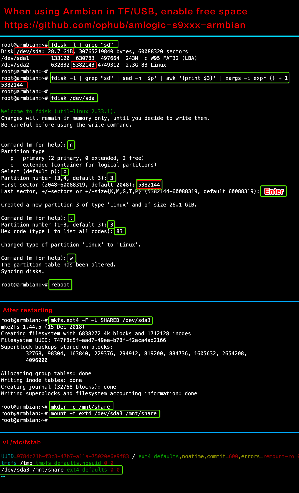

# 释放外置存储资源

通常我们会选择将系统安装在**U盘**、**TF卡**、**外置移动硬盘**等存储设备上。因为内置的 `EMMC` 仅有 `8G` 的存储空间，去除备份、恢复分区等占用，可以资源为 `6G` ，基本上不太够用。

```bash
$ armbian-tf
```

根据提示输入 `e` 将剩余空间扩容至当前系统分区和文件系统。不要输入 `c!!!`

## 附

手动分配剩余空间

```bash
# 1. 根据空间大小确认 TF/SD/USB 的名称，TF/SD 为 [ mmcblk ]，USB 为[ sd ]
在命令行中: 输入 [ fdisk -l | grep "sd" ] 查看卡的名称

# 2. 获取剩余空间的起始值，复制并保存，下面使用（例如：5382144）
在命令行中: 输入 [ fdisk -l | grep "sd" | sed -n '$p' | awk '{print $3}' | xargs -i expr {} + 1 ] 得到剩余空间起始值

# 3. 开始分配未使用的空间（例如：sda、mmcblk0 或 mmcblk1）
在命令行中: 输入 [ fdisk /dev/sda ] 开始分配剩余空间
在命令行中: 输入 [ n ] 创建新分区
在命令行中: 输入 [ p ] 指定分区类型为主分区
在命令行中: 将分区号设置为 [ 3 ]
在命令行中: 分区的起始值，输入第二步得到的值 [ 5382144 ]
在命令行中: 分区的结束值，按 [ 回车 ] 使用默认值
在命令行中: 如果提示是否删除签名？[Y]es/[N]o: 输入 [ Y ]
在命令行中: 输入 [ t ] 指定分区类型
在命令行中: 输入分区编号 [ 3 ]
在命令行中: 指定分区类型为 Linux，输入代码 [ 83 ]
在命令行中: 输入 [ w ] 保存结果
在命令行中: 输入 [ reboot ] 重启

# 4. 重新启动后，格式化新分区
在命令行中: 输入 [ mkfs.ext4 -F -L SHARED /dev/sda3 ] 格式新分区

# 5. 为新分区设置挂载目录
在命令行中: 输入 [ mkdir -p /mnt/share ] 创建新分区的挂载目录
在命令行中: 输入 [ mount -t ext4 /dev/sda3 /mnt/share ] 进行挂载

# 6. 添加开机自动挂载
在命令行中: [ vi /etc/fstab ]
# 按 [ i ] 进入编译模式，将下面的代码复制，黏贴到文件的末尾处
/dev/sda3 /mnt/share ext4 defaults 0 0
# 按 [ esc ] 键退出，输入 [ :wq! ] 后按 [ 回车 ] 保存退出，结束设置。
```

