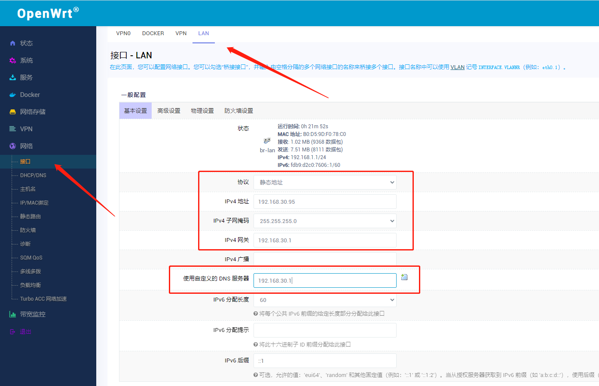
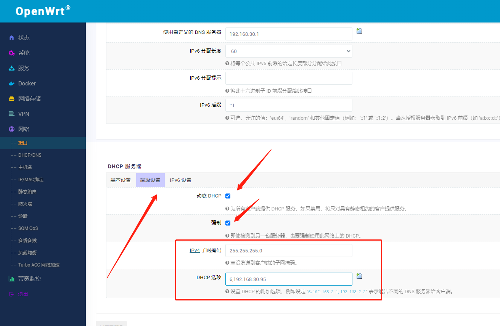

# 旁路由配置

> [!tip|label: 提示]
> 刷入固件版本：[openwrt_s912_zyxq_R22.5.5_k5.15.38-flippy-72+o.7z](https://megrez-file.virtualbing.fun/%E6%8A%98%E8%85%BE/%E7%AB%A0%E9%B1%BC%E6%98%9F%E7%90%83/%E5%88%B7%E6%9C%BA%E5%A5%97%E8%A3%85/openwrt_s912_zyxq_R22.5.5_k5.15.38-flippy-72%2Bo.7z)

## 进入系统

刷好之后将电脑与章鱼星球通过网线直连，然后浏览器输入 `192.168.1.1` ，用户名默认为 `root` ，密码为 `password` 。

## 配置

### 基本配置

进入 `网络` ——> `接口` ——> `LAN` 配置页面。

编辑基本设置：

1. 协议选择静态地址
2. IPV4地址写一个网段内的ip，**注意不要冲突**
3. 子网掩码就是`255.255.255.0`
4. IPv4网关写**路由器的地址**
5. IPv4广播不写
6. 自定义DNS写**路由器的地址。**

### DHCP 配置

在DHCP基本设置中**千万不要勾选**忽略此接口选框。

接下来在**高级设置**中进行如下配置：

1. **勾选**动态DHCP
2. **勾选**强制
3. IPv4子网掩码写`255.255.255.0`
4. DHCP选项填：`6,本机IP`

