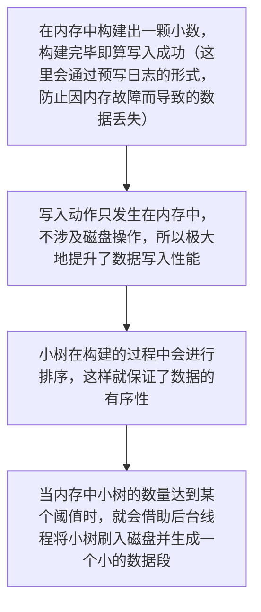
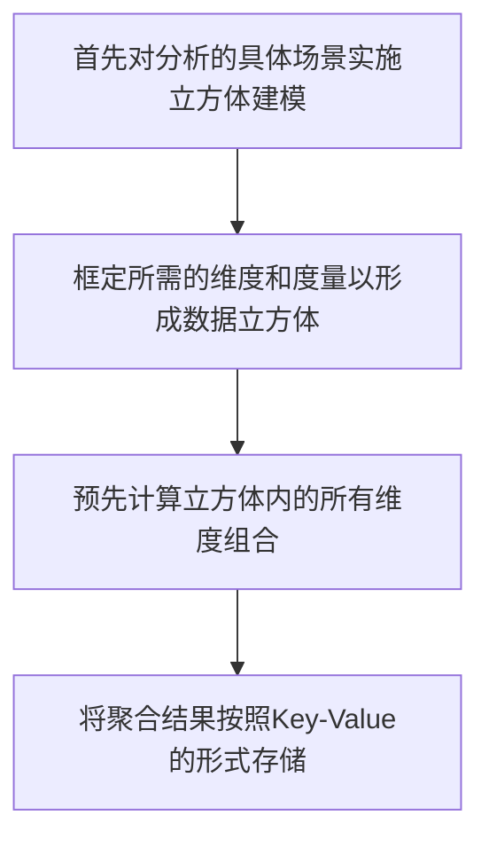

# 另辟蹊径的Metrage时期

由于 `MySQL` 带来的局限性， `Yandex` 自研了一套全新的系统并命名为 `Metrage` 。 `Metrage` 在设计上与 `MySQL` 完全不同，他选择了另外一条截然不同的道路。首先，在数据模型层面，他使用 `Key-Value` 模型（键值对）代替了关系型模型；其次，在索引层面，他使用 `LSM` 树代替了 `B+` 树；最后，在数据处理层面，有实时查询的方式改为**预处理**的方式。

`LSM` 树也是一种非常流行的索引结构，发源于 `Google` 的 `Big Table` ，现在最具有代表性的使用 `LSM` 树索引结构的系统是 `HBase` 。 `LSM` 本质上可以看做**将原本的一棵大树拆成了许多棵小数**，每一批写入的数据都会经历如下过程：

在每个数据段中，数据局部有序，也正因为数据有序，所以能够进一步使用**稀疏索引**来优化查询性能。借助 `LSM` 树索引，可使得 `Metrage` 引擎在软硬件层面同时得到优化（**磁盘顺序读取**、**预读缓存**、**稀疏索引**等），最终有效提高系统的综合性能。

如果仅拥有索引结构的优化，还不足以从根本上解决性能问题。 `Metrage` 设计的第二个重大转变是通过**预处理**的方式，将需要分析的数据预先聚合。这种做法类似数据立方体的思想，如下所示：

这样一来，对于固定分析场景，就可以直接利用数据立方的聚合结果立即返回相关数据。这套系统的实现思路和现今的一些 `MOLAP` 系统如出一辙。

通过上述一系列的转变， `Metrage` 为 `Yandex.Metrica` 的性能带来了革命性提升。截止 `2015` 年，在 `Metrica` 内存储了超过**3万亿**行的数据，其集群规模超过了 `60` 台服务器，查询性能也由先前的 `26` 秒降低到了惊人的 `1` 秒以内。然而，使用立方体这类预先聚合的思路会带来一个新的问题，那就是**维度组合爆炸**，因为需要预先对所有的维度组合进行计算。那么维度组合的方式具体有多少种呢？他的计算公式是 `2^N^` （ `N` =**维度数量**）。可以做一次简单的计算，例如 `5` 个维度的组合方式会有 `2^5^=32` 中，而 `9` 个纬度的组合方式则会多达 `2^9^=512` 种，这是一种**指数级**的增长方式。维度组合的爆炸会直接导致数据膨胀，有时候这些膨胀可能会多大 `10~20` 倍。
