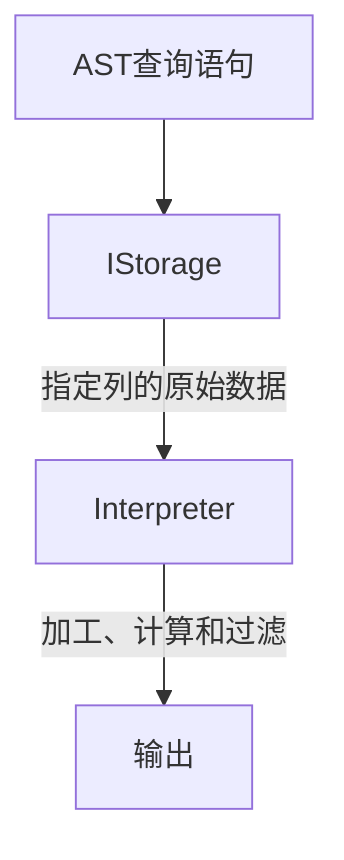

# Table

在数据表的底层设计中并**没有**所谓的 `Table` 对象，他直接使用 `IStorage` 接口指代数据表。表引擎是 `ClickHouse` 的一个显著特性，不同的表引擎由不同的子类实现，例如 `IStorageSystemOneBlock` （**系统表**）、 `StorageMergeTree` （**合并树表引擎**）和 `StorageTinyLog` （**日志表引擎**）等。 `IStorage` 接口定义了 `DDL` （如 `ALTER` 、 `RENAME` 、 `OPTIMIZE` 和 `DROP` 等）、 `read` 和 `write` 方法，他们分别负责数据的定义、查询与写入。在数据查询时， `IStorage` 负责根据 `AST` 查询语句的指示要求，返回指定列的原始数据。后续对数据的进一步加工、计算和过滤，则会统一交由 `Interpreter` 解释器对象处理。对 `Table` 发起的一次操作通常都会经历这样的过程：

