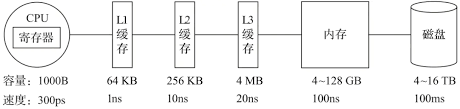

# 向量化执行引擎

坊间有句玩笑，即“能用钱解决的问题，千万别花时间”。而业界也有这种调侃如出一辙，即“能升级硬件解决的问题，千万别优化程序”。有时候，你千辛万苦优化程序逻辑带来的性能提升，还不如直接升级硬件来的简单直接。这虽然只是一句玩笑不能当真，但**硬件层面的优化确实是最直接、最高效的提升途径之一**。**向量化执行**就是这种方式的典型代表，这项**寄存器**硬件层面的特性，为上层应用程序的性能带来了指数级的提升。

向量化执行，可以简单地看做一项消除程序中循环的优化。这里用一个形象的例子比喻：小胡经营了一家果汁店，虽然店里的鲜榨果汁深受大家喜爱，但客户总是抱怨制作果汁的速度太慢。小胡的店里只有一台榨汁机，每次他都会从篮子里拿出一个苹果，放到榨汁机内等待出汁。如果有 `8` 个客户，每个客户点了一杯果汁，那么小胡需要重复循环 `8` 此上述的榨汁流程，才能炸出 `8` 杯苹果汁。如果制作一杯果汁需要 `5` 分钟，那么全部制作完毕需要 `40` 分钟。为了提升果汁的制作速度，小胡想出了一个办法。他将榨汁机的数量从 `1` 台增加到了 `8` 台，这么一来，他就可以从篮子里一次性拿出 `8` 个苹果，分别放入 `8` 台榨汁机同时榨汁。此时，小胡只需要 `5` 分钟就能制作出 `8` 杯苹果汁。为了制作 `n` 杯果汁，非向量化执行的方式是用 `1` 台榨汁机重复循环制作 `n` 次，而向量化执行的方式是用 `n` 台榨汁机只执行 `1` 次。

为了实现向量化执行，需要利用 `CPU` 和 `SIMD` 指令。 `SIMD` 的全称是**Single Instruction Multiple Data**，即用单条指令操作多条数据。现代计算机概念中，他是通过数据并行以提高性能的一种实现方式（其他的还有指令级并行和线程并行），他的原理是在 `CPU` 寄存器层面实现数据的并行操作。

在计算机系统的体系结构中，存储系统是一种层级结构。典型服务器计算机的存储层次结构如下所示。一个实用的经验告诉我们，存储媒介距离 `CPU` 越近，则访问数据的速度越快。

从上图中可以看到，从左向右，距离 `CPU` 越远，则数据的访问速度越慢。从寄存器中访问数据的速度，是从内存访问数据速度的 `300` 倍，是从磁盘中访问数据速度的 `3000` 万倍。所以利用 `CPU` 向量化执行的特性，对于程序的性能提升意义非凡。

> [!tip|label: 提示]
> `ClickHouse` 目前利用 `SSE4.2` 指令集实现向量化执行。
