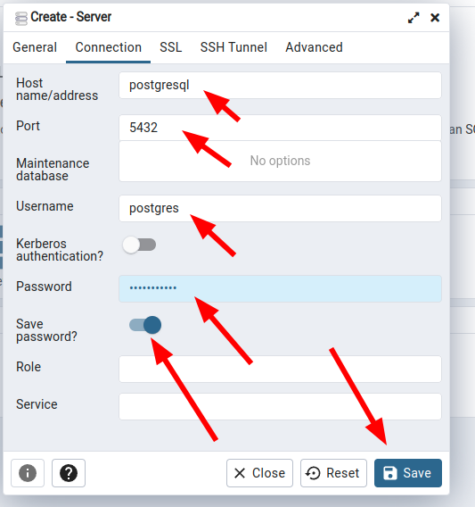

# 连接数据库

## Step1. 进入系统

如果是 `docker-compose` 安装的，那就从 `docker-compose.yaml` 中找到绑定的**端口**，打开，并输入邮箱和密码，进入系统。

## Step2. 创建服务

在左上角的 `servers` 上**右键**，选择 `create` ，之后选择 `server` ，如下所示：

## Step3. 连接配置

首先配置 `General` 选项卡里面的内容，只需要输入 `Name` 即可，其他的不用动，输入什么都行，只是一个标识。

接下来切换到 `Connection` 选项卡继续配置。

注意这里的 `Host name/address` 字段，如果 `pgAdmin` 和**数据库**都是 `docker-compose` 部署，一般是 `PostgreSQL` 的 `service` 名称，当然，这个 `docker` 的网络是很复杂的，要具体分析，完全搞懂必须先搞明白 `docker` 的网络部分，参加笔记：[Docker 网络](../../../../容器/Docker/基础知识/网络/README.md)

如果是本机直接安装的，一般写 `localhose` 或 `127.0.0.1` 即可。

**端口**默认一般都是 `5432`

`Username` 一般都是 `postgres`

点击**保存**即可。

## 完成

添加完成，即可在左侧侧边栏看到数据库信息，如下所示：

