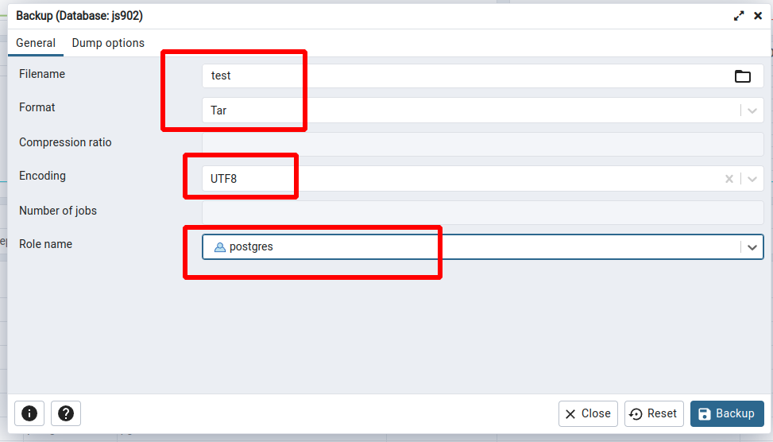

# pgAdmin

## Step1. 进入备份

在想要备份的数据上**右键**，选择 `Backup` ，进入备份信息配置面板。

## Step2. 配置备份信息

首先填写 `Filename` ，这个字段填写什么都可以，接下来选择 `Format` 类型，候选项： `Custom` 、 `Tar` 、 `Plain` 和 `Directory` ，我们选择常用的 `Tar` 类型。

`Encoding` 选择 `UTF8` 格式。如下所示：

接下来点击 `Backup` 按钮即可。

## Step3. 备份下载

备份好了会默认保存在 `pgAdmin` 的服务中，一般我们使用 `docker` 来安装这个服务，就会导致备份好的文件想要搞到自己的电脑上比较麻烦。 `pgAdmin` 提供了**存储管理**功能，能让我们直接查看备份文件，并很好的把文件下载到自己的电脑上。

进入存储管理的路径是：左上角菜单 `Tools` ——> `Storage Manager` ，如下所示：

接下来选中刚刚备份好的文件，点击下载按钮即可：

