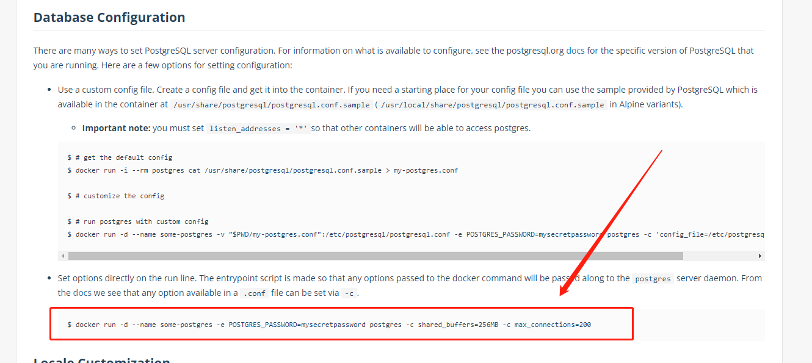

# 数据库连接数配置

## 问题出现场景

线上服务多开，数据库用 `docker` 部署的，然后发现系统日志中报有 `sorry, too many clients already` 的错误，看提示是 `PG` 库的连接数被占满了。

经过思考， `PostgreSQL` 数据库的默认最大连接数是 `100` ，我们是 `node` 服务，使用 `nestjs` 框架， `typeorm` 来连接数据库，如果没记错的话，这种方式默认下一个服务会建立 `10` 个数据库连接。服务器是 `16` 核心的，起了 `12` 个 `node` 服务，因此最大会有 `120` 个数据库连接，出现此问题合情合理。

那么解决方法也就是将数据库的最大连接数配置的高一点就可以了。

## 方式一

修改配置文件，首先进入到容器，进入 `psql` 环境，如下所示：

```bash
$ docker exec -it postgresql /bin/bash
$ su postgres
$ psql
postgres=#
```

首先查看一下数据库最大连接数，如下所示：

```sql
postgres=# show max_connections;
 max_connections 
-----------------
 100
(1 row)
```

可以看到目前的数据库最大连接数是 `100` ，接下来查看 `pg` 库设置 `max_connections` 的配置文件的路径：

```sql
postgres=# select name, setting, boot_val, reset_val, sourcefile from pg_settings where name = 'max_connections';
      name       | setting | boot_val | reset_val |                sourcefile                
-----------------+---------+----------+-----------+------------------------------------------
 max_connections | 100     | 100      | 100       | /var/lib/postgresql/data/postgresql.conf
(1 row)
```

命令解释：
* name = 配置项名字
* setting = 配置项的value
* boot_val = 配置项的初始化value
* sourcefile = 配置项所在的配置文件的路径

接下来在容器中使用 `vi` 来修改 `/var/lib/postgresql/data/postgresql.conf` 文件就好了。（我试过，没有vim，只有vi）

修改完成后重启容器即可。

> [!tip|label: 提示]
> 容器可能没有安装vi/vim这类编辑器，遇到此情况，可以在宿主机中找到挂载卷的地址，直接修改。

## 方式二

依据 `postgres` 在 `docker hub` 中的镜像描述有提到过这部分，文档地址：https://hub.docker.com/_/postgres



我们是用 `docker compose` 来部署的，文档中是用 `docker run` 来运行的， `docker run` 中的 `-c` 命令接触的少，目前还不知道在 `docker-compose.yaml` 配置文件中如何写，这个后续过来补。
