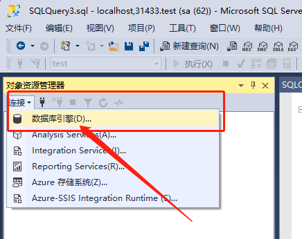
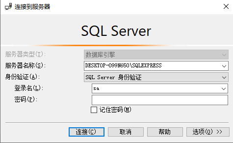
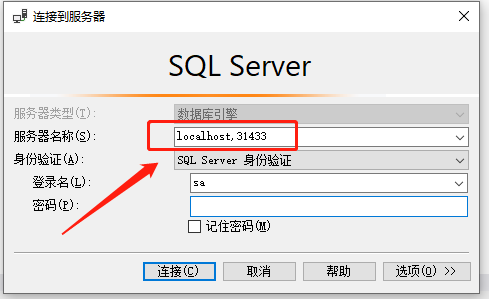

# SQL Server 身份认证

`SQL Server` 身份认证是一种和代码驱动数据库性质一样的认证连接方式。其本质上走的是 `TCP/IP` 协议，通过数据库开放接口协议来连接数据库的。

新建一个数据库连接，如下所示：

在连接的时候选择**数据库引擎**，之后弹出连接配置信息弹窗，如下所示：

这里面要在**身份验证**部分选择 `SQL Server 身份验证` ，服务器名称如果是本地的，可以直接选择，类似于 `DESKTOP-O99N650\SQLEXPRESS` 这样。接下来输入用户名（默认 `sa` ）和密码，进行连接即可。

> [!tip|label: 提示]
> 服务器名称如果输入 `localhost` ，表示连接本地，默认端口为 `1433` ，如果想要指定端口（例如通过 `docker` 来安装的数据库，并且 `1433` 端口不给使用）就需要修改连接格式，这个和通常的 `ip:port` 形式完全不一样，是 `ip,port` 的形式！
>  
