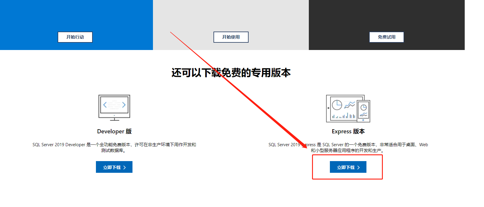
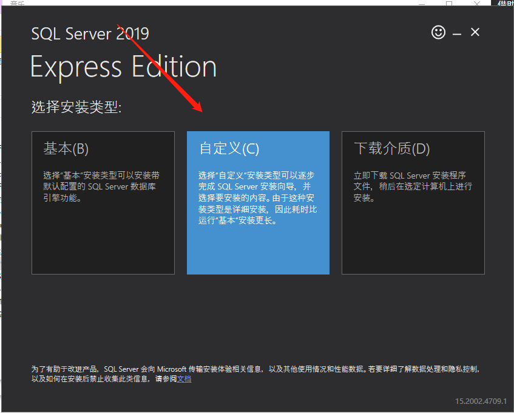

# Windows10 安装

> [!tip|label: 提示]
> 本次安装基于 `SQL Server 2019 Express` 版本。

在官网下载即可，[官网下载页面](https://www.microsoft.com/zh-cn/sql-server/sql-server-downloads#)

如下所示：

之后双击安装，注意选择自定义安装，接下来更改安装地址即可。

## 安装注意事项

在安装的时候，不要安装什么 `Java` 、 `R` 、 `Pytho` n支持，只选择 `LocalDB` 和 `SQL Server` 复制即可。选择认证的时候注意选择 `WIndows` 身份认证和 `SQLServer` 身份验证两种认证。
