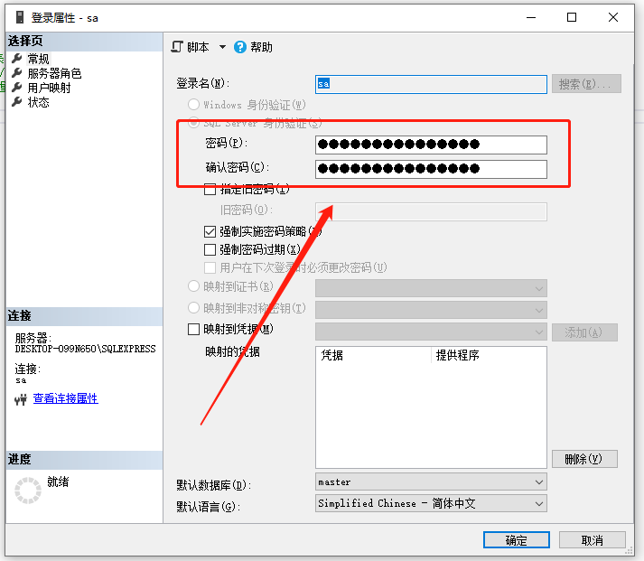

# 忘记sa用户密码

忘记密码后需要使用 `SSMS` 管理工具来重置 `sa` 用户密码，可视化的操作非常简单。

## Step1. 使用Windows身份验证登录

首先打开 `SSMS` 管理软件，因为忘记了 `sa` 用户的密码，就先使用 `Windows` 身份验证登录，这个不需要输入密码。

## Step2. 重置密码

以此选择 `安全性` ——> `登录名` ——> `sa` ，在 `sa` 上**右键**，选择**属性**，调出登录属性，直接修改密码即可，非常简单，如下所示：

