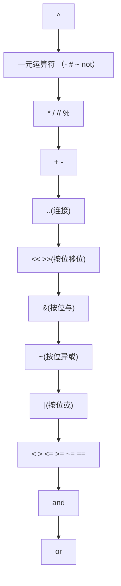

# 运算符优先级

`Lua` 语言中的运算符优先级如下所示（从上到下，优先级逐渐变低）

```mermaid
graph TD;
  A["^"] --> B["一元运算符 （- # ~ not）"];
  B --> C["* / // %"]
  C --> D["+ -"]
  D --> E["..(连接)"]
  E --> F["<< >>(按位移位)"]
  F --> G["&(按位与)"]
  G --> H["~(按位异或)"]
  H --> I["|(按位或)"]
  I --> J["< > <= >= ~= =="]
  J --> K["and"]
  K --> L["or"]
```

在**二元运算**符中，除了**幂运算**和**连接操作符**是**右结**合的外，其他运算符都是**左结合**的。

当不能确定某些表达式的运算符优先级时，应该显示地用**括号**来指定所希望的运算次序。这比查看参考手册方便，也不至于让别人在阅读你的代码时产生同样的疑问。
