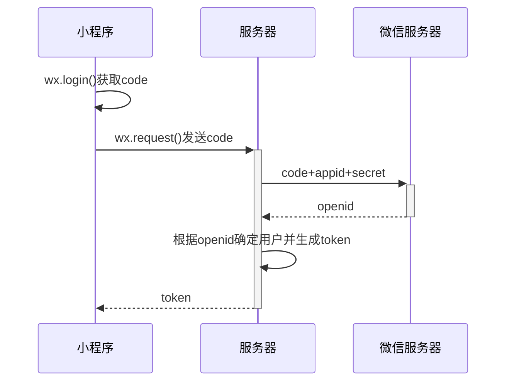
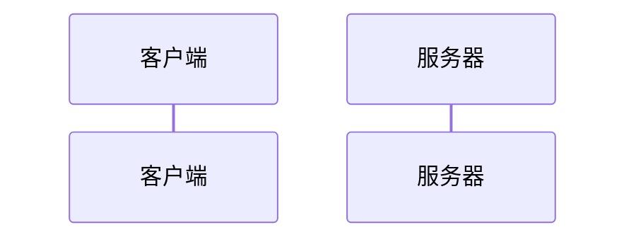
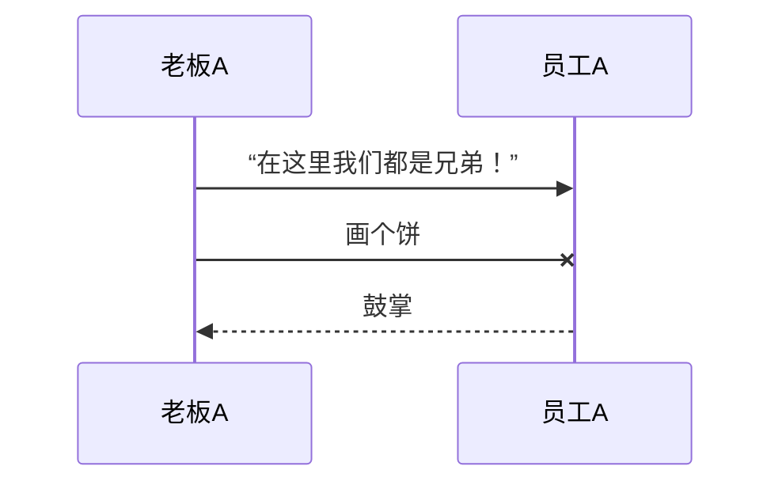
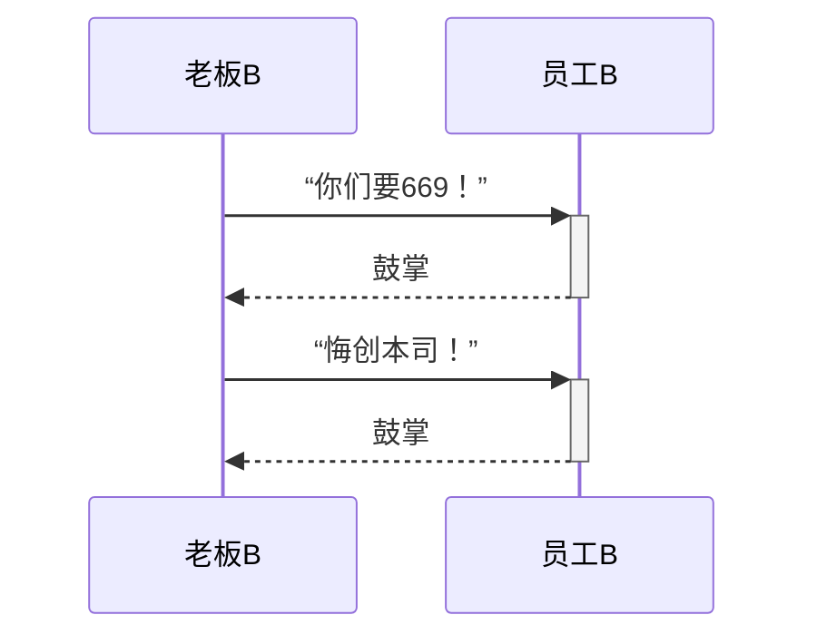
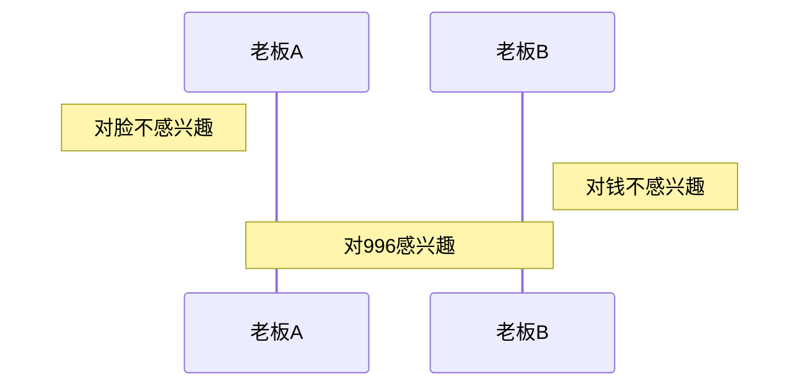
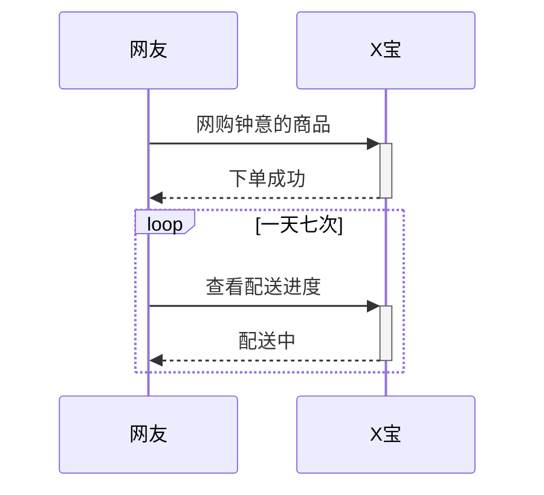
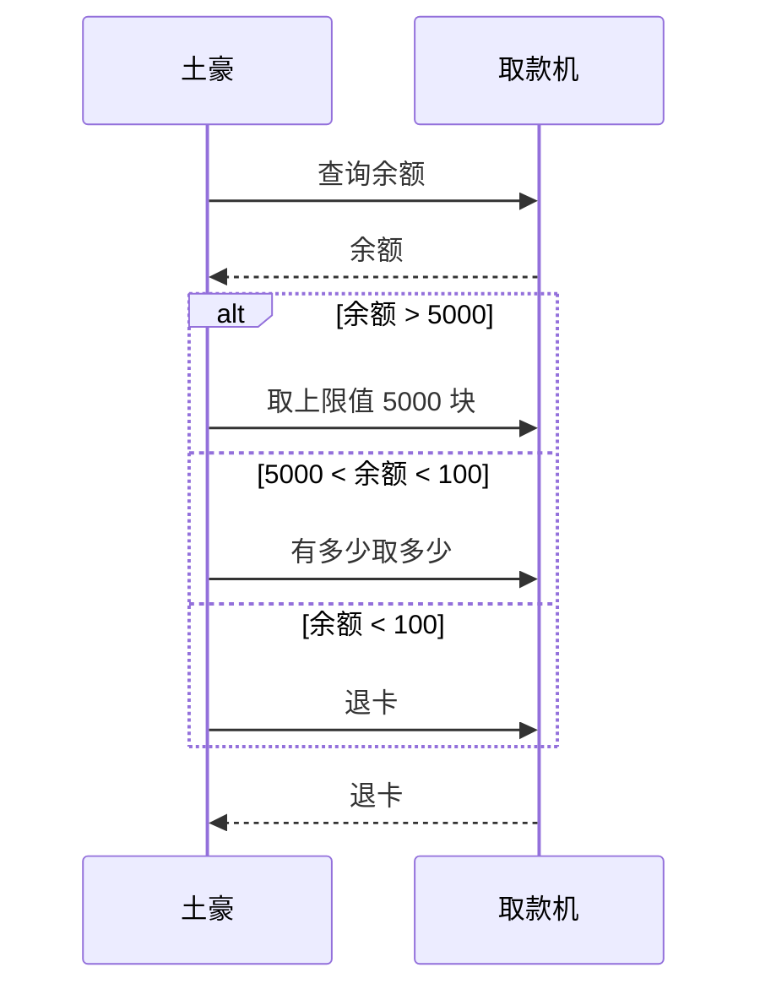
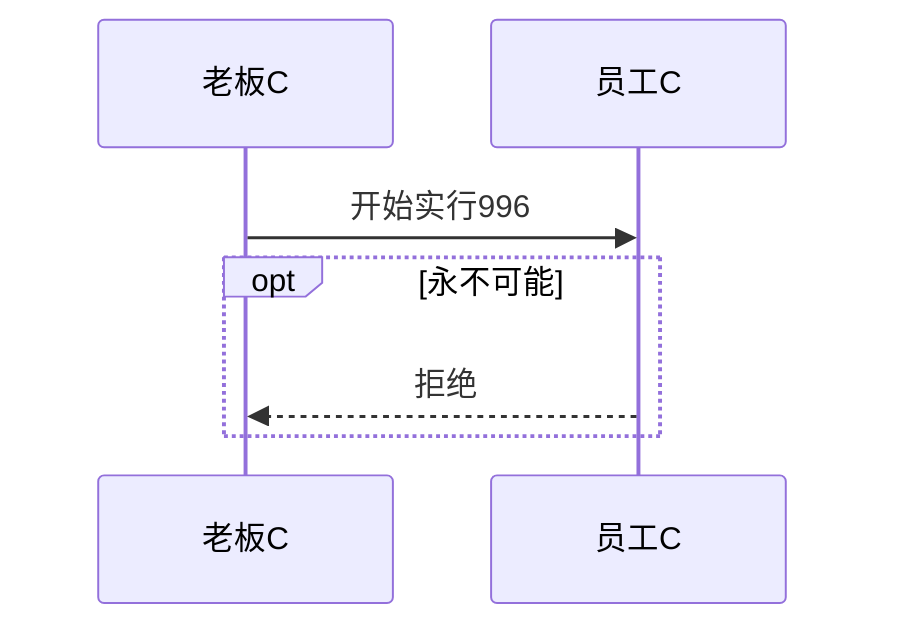
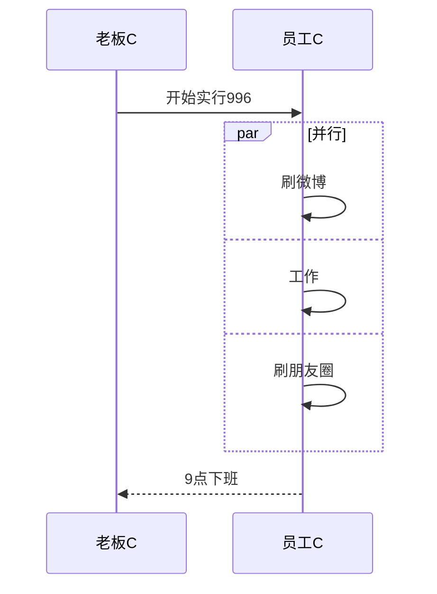

# 序列图

先看图：



源代码：

```markdown
sequenceDiagram
  小程序 ->> 小程序 : wx.login()获取code
  小程序 ->> + 服务器 : wx.request()发送code
  服务器 ->> + 微信服务器 : code+appid+secret
  微信服务器 -->> - 服务器 : openid
  服务器 ->> 服务器 : 根据openid确定用户并生成token
  服务器 -->> - 小程序 : token
```

**时序图**是一种表现**交互过程**的图示，主要展示各个参与者之间是如何交互的，以及交互的顺序是怎样的。它的主要构成元素有：参与者、

## 参与者

传统时序图概念中参与者有**角色**和**类对象**之分，但这里我们不做此区分，用参与者表示一切参与交互的事物，可以是人、类对象、系统等形式。中间竖直的线段从上至下表示时间的流逝。

语法：

```markdown
sequenceDiagram
  participant <参与者名称>
```

示例：

```markdown
sequenceDiagram
  participant 客户端
  participant 服务器
```



> [!tip|label: 提示]
> `participant <参与者名称>` 这句可以省略，省略后参与者横向排列的次序，由消息语句中其出现的次序决定。

## 消息

交互时一方对另一方的操作（比如接口调用）或传递出的信息。用**单向箭头**来表示——实线代表主动发出消息；**虚线**代表响应；末尾带 `X` 代表**异步**消息，无需等待回应。

语法：

```markdown
sequenceDiagram
  <参与者> <箭头> <参与者> : <描述文本>
```

其中，箭头的写法有如下几种格式：

|写法|显示|含义|
|-----|-----|-----|
| `->>` |实线箭头|主动发出消息|
| `-->>` |虚线箭头|响应|
| `-x` |末尾带 `X` 的实线箭头|异步消息|

示例：

```markdown
sequenceDiagram
  participant 老板A
  participant 员工A

  老板A ->> 员工A : “在这里我们都是兄弟！”
  老板A -x 员工A : 画个饼
  员工A -->> 老板A : 鼓掌
```



## 激活框

从消息接收方的时间线上标记一小段时间，表示对消息进行处理的时间间隔。

```markdown
sequenceDiagram
  老板B ->> + 员工B : “你们要669！”
  员工B -->> - 老板B : 鼓掌
  
  老板B ->> + 员工B : “悔创本司！”
  员工B -->> - 老板B : 鼓掌
```



> [!tip]
> 体会上面的+和-的使用方法和效果，它们相当于激活框的开关。

## 注解

```markdown
sequenceDiagram
  Note left of 老板A : 对脸不感兴趣
  Note right of 老板B : 对钱不感兴趣
  Note over 老板A,老板B : 对996感兴趣
```



## 循环（loop）

在条件满足时，重复发出消息序列。相当于编程语言中的 `while` 语句。

```markdown
sequenceDiagram
  网友 ->> + X宝 : 网购钟意的商品
  X宝 -->> - 网友 : 下单成功
  
  loop 一天七次
    网友 ->> + X宝 : 查看配送进度
    X宝 -->> - 网友 : 配送中
  end
```



## 选择（alt）

在多个条件中作出判断，每个条件将对应不同的消息序列。相当于 `if` 及 `else if` 语句。

```markdown
sequenceDiagram    
  土豪 ->> 取款机 : 查询余额
  取款机 -->> 土豪 : 余额
  
  alt 余额 > 5000
    土豪 ->> 取款机 : 取上限值 5000 块
  else 5000 < 余额 < 100
    土豪 ->> 取款机 : 有多少取多少
  else 余额 < 100
    土豪 ->> 取款机 : 退卡
  end
  
  取款机 -->> 土豪 : 退卡
```



## 可选（opt）

在某条件满足时执行消息序列，否则不执行。相当于单个分支的 `if` 语句。

```markdown
sequenceDiagram
  老板C ->> 员工C : 开始实行996
  
  opt 永不可能
    员工C -->> 老板C : 拒绝
  end
```



## 并行（Par）

将消息序列分成多个片段，这些片段并行执行。

```markdown
sequenceDiagram
  老板C ->> 员工C : 开始实行996
  
  par 并行
    员工C ->> 员工C : 刷微博
  and
    员工C ->> 员工C : 工作
  and
    员工C ->> 员工C : 刷朋友圈
  end
  
  员工C -->> 老板C : 9点下班
```

