# 流程图

## 语法

```markdown
flowchart direction
  node1 --> node2
```

> [!tip|label: 提示]
> `flowchart` 是新写法， `graph` 是旧写法，两者兼容，建议用新写法。

### direction

用于声明流程图的方向：

|direction|方向|
|-----|-----|
| `TD` / `TB` /**默认**|从上往下|
| `BT` |从下往上|
| `LR` |从左往右|
| `RL` |从右往左|

### node

`node` 为流程图中的节点，可以分为**无名节点**和**具名节点**两种：

* **无名结点**：直接写内容，此时结点边框为**方形**；节点内容不能有**空格**。
* **具名结点**：节点名后书写内容，内容左右有**特定符号**，结点边框由符号决定；节点内容可以有空格。

示例

```markdown
flowchart
  默认方形
  id1[方形]
  id2(圆边矩形)
  id3([体育场形])
  id4[[子程序形]]
  id5[(圆柱形)]
  id6((圆形))
```

效果


示例

```markdown
flowchart
	id1{菱形}
	id2{{六角形}}
	id3[/平行四边形/]
	id4[\反向平行四边形\]
	id5[/梯形\]
	id6[\反向梯形/]
```

效果


### 连线样式

#### 实线箭头

无文本：

```markdown
flowchart
  a --> b
```

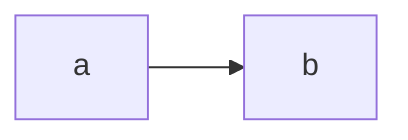

有文本：

```markdown
flowchart LR
  a -- 文本1 --> b --> |文本  2| d
```

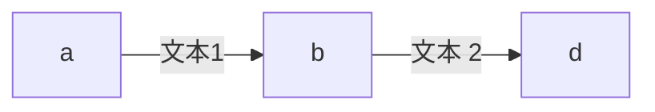

#### 粗实线箭头

```markdown
flowchart LR
a ==> b ==文本==> c
```

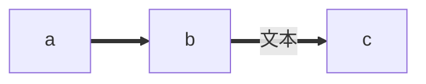

#### 虚线箭头

```markdown
flowchart LR
  a -.-> b -.文本.-> c
```

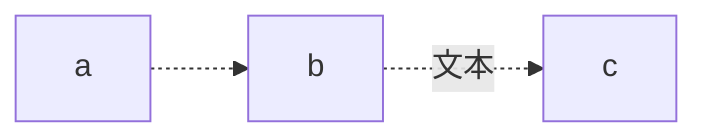

#### 无箭头线

> [!tip|label: 提示]
> 无箭头线就是有箭头线去掉 `>` 。

```markdown
flowchart LR
  a---b
  b--文本1---c
  c---|文本2|d
  d===e
  e==文本3===f
  f-.-g
  g-.文本.-h
```

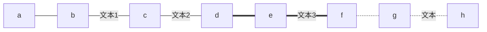

#### 其他连线

> [!warning|label: 注意]
> 下面的连接线不支持 `graph` 关键字，必须使用新版的 `flowchart` 关键字。

```markdown
flowchart LR
  A o--o B
  B <--> C
  C x--x D
```


#### 延长连线

增加相应字符即可，如下图中的 `B` 到 `E` ，连线中增加了一个 `-` 。字符可**多次添加**。

```markdown
flowchart LR
  A[Start] --> B{Is it?};
  B -->|Yes| C[OK];
  C --> D[Rethink];
  D --> B;
  B --->|No| E[End];
```

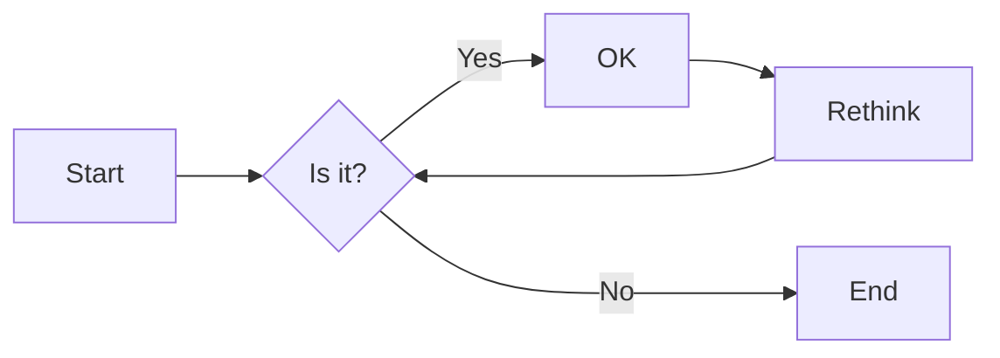

如果不使用延长线的效果:

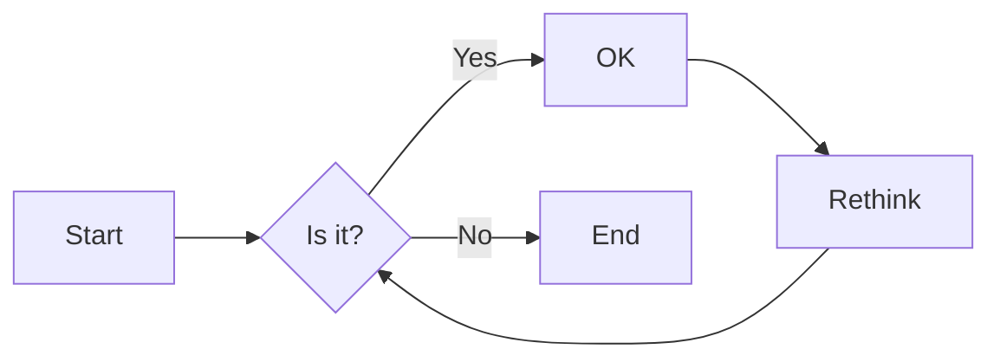

### 连线形式

#### 直连

```markdown
flowchart LR
  A -- text --> B -- text2 --> C
```

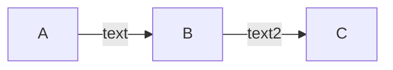

#### 多重连

可以使用 `&` 字符，或**单个描述**。

```markdown
flowchart 
  a --> b & c--> d
  A & B--> C & D
  X --> M
  X --> N
  Y --> M
  Y --> N
```

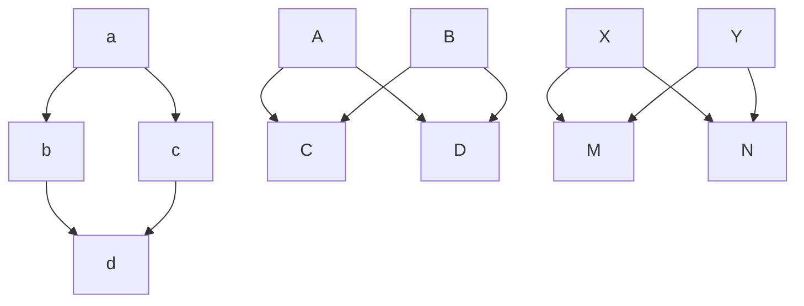

## 子图

> [!warning|label: 注意]
> 子图不支持 `graph` 关键字，必须使用新版的 `flowchart` 关键字。

在代码段的开始加入 `subgraph` ，尾部加入 `end` 。

```markdown
flowchart TB
  c1-->a2
  subgraph one
  a1-->a2
  end
  subgraph two
  b1-->b2
  end
  subgraph three
  c1-->c2
  end
  one --> two
  three --> two
  two --> c2
```

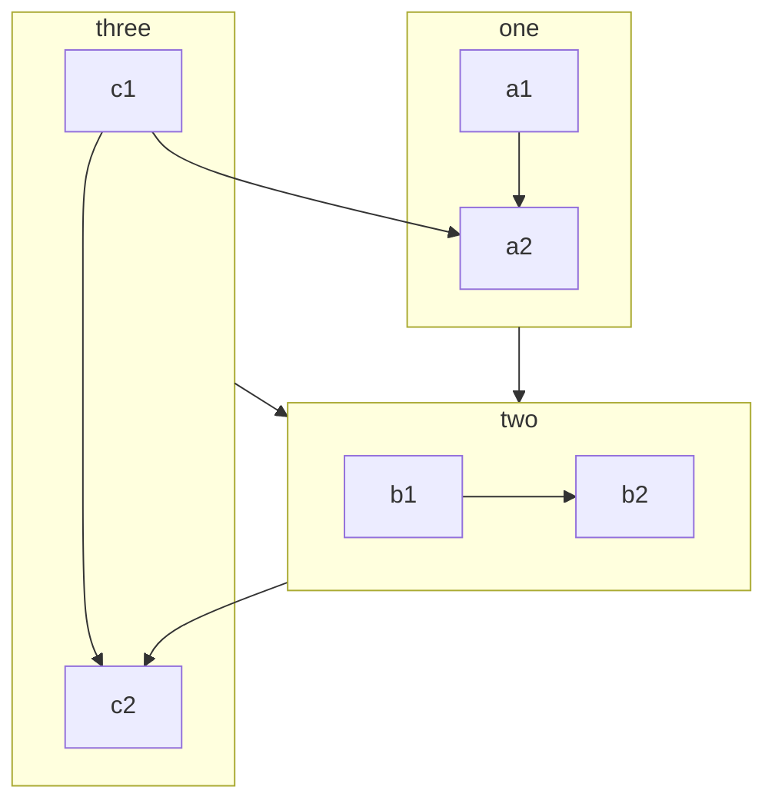

## 注释

在**行首**加入 `%%` 即可。

```markdown
flowchart LR
%%这是一条注释，在渲染图中不可见
  A[Hard edge] -->|Link text| B(Round edge)
  B --> C{Decision}
  C -->|One| D[Result one]
  C -->|Two| E[Result two]
```

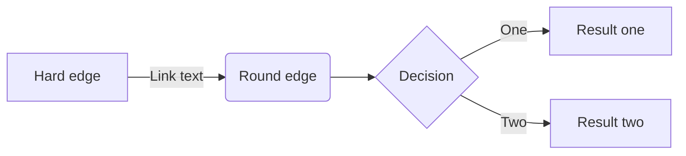
