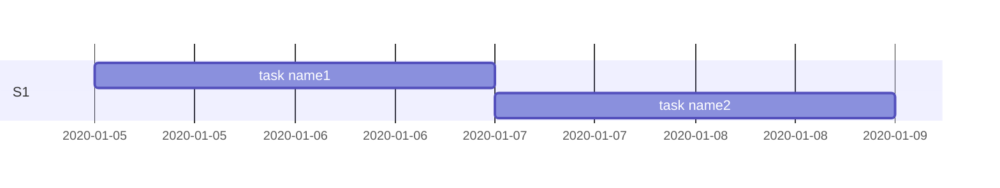

# 甘特图

## 简介

甘特图是工程计划中常用的一种图形，用以管理**任务的分解**、**时间的长度**和**节点计划**、以及**实际进度**和**计划进度**的差距等等。

甘特图将记录每个计划的任务作为一个**连续的条形**，从左到右延伸。 `x` 轴表示**时间**， `y` 轴记录不同的**任务**及其完成顺序。

## 语法

甘特图语法分为以下几个部分

### gantt

开头标志，表明这是一张甘特图

```markdown
gantt 
```

### title

甘特图的标题。

> [!tip|label: 提示]
> 注意 `title` 是可以**缺省**的，甘特图可以不加标题。

```markdown
gantt 
  title This is a title
```

### 时间格式

甘特图指定时间格式的关键字为dateFormat：

```markdown
gantt 
  dateFormat YYYY-MM-DD
```

dateFormat允许的时间格式一览表：

|输入|举例|描述|
|----|----|----|
| `YYYY` |2021|4位数表示年份|
| `YY` |21|2位数表示年份|
| `Q` |1…4|表示季度，设置月份时将直接跳到季度的第一个月份|
| `M MM` |1…12|按数字表示的月份|
| `MMM MMMM` |Jan…Dec|按月份简称表示的月份|
| `D DD` |1…31|按数字表示的日期|
| `DDD DDDD` |1…365|按日期在一年365天中的次序来显示日期|
| `X` |1410715640.579|Unix的时间戳，秒级|
| `x` |1410715640579|Unix的时间戳，毫秒级|
| `H HH` |0…23|24小时制|
| `h hh` |1…12|12小时制，和a A一起用|
| `a A` |am pm|上下午时刻制|
| `m mm` |0…59|数字显示的分钟|
| `s ss` |0…59|数字显示的秒|
| `S` |0…9|十分之一秒显示|
| `SS` |0…99|百分之一秒显示|
| `SSS` |0…999|千分之一秒显示|
| `Z ZZ` |+12:00|UTC标准时区差距, ±HH:mm, ±HHmm, 或者是Z|

### 时间轴格式

`axisFormat` 关键字用以指定时间轴的单位格式，默认的时间格式是 `YYYY-MM-DD` 。

用 `axisFormat` 关键字来指定时间单位格式时，每一个组合都是由一个 `%` 引导，如下例所示：

```markdown
axisFormat %Y-%m-%d
```

`%Y` 表示的是**年**， `%m` 表示的**月**， `%d` 表示的是**天**。

|符号写法|含义|样例举例|
|-----|-----|-----|
| `%a` |缩写的星期几的名称| `Mon`  `Tue`  `Wed`  `Thu`  `Fri`  `Sat`  `Sun` |
| `%A` |全称的星期几的名称| `Monday`  `Tuesday`  `Wednesday`  `Thursday`  `Friday`  `Saturday`  `Sunday` |
| `%b` |缩写的月份名称| `Jan`  `Feb`  `Mar`  `Apr`  `May`  `Jun`  `Jul`  `Aug`  `Sep`  `Oct`  `Nov`  `Dec` |
| `%B` |全称的月份名称| `January`  `February`  `March`  `April`  `May`  `June`  `July`  `August`  `September`  `October`  `November`  `December` |
| `%c` |日期和时间，和" `%a %b %e %H:%M:%S %Y` "一样| `Mon Apr 3 12:11:23 2020` |
| `%d` |用 `0` 填充补位的月份中的日期，十位小数 `[01, 31]` | `01 02 03 04 05…31` |
| `%e` |用空格填充补位的月份中的日期，十位小数 `[ 1, 31]` | `_1` , `_2` , `_3` … `31` ( `_` 表示补位的**空格**)|
| `%H` |24小时制十进制数表示小时|1 2 3 4 5 … 24|
| `%I` |12小时制十进制数表示小时|1 2 3 4 5 … 12|
| `%j` |十进制数表示一年中的第几天[001, 366]|001， 002， 003 … 366|
| `%m` |十进制数表示月份[01, 12]|01, 02, 03 … 12|
| `%M` |十进制表示分钟[00, 59]|00, 01, 02, 03 … 59|
| `%L` |十进制表示毫秒[000, 999]|000, 001, 002 … 999|
| `%p` |AM或者PM|AM PM|
| `%S` |十进制表示秒数[00, 61]|00, 01, 02, 03 … 61|
| `%U` |十进制表示一年中的第几周（星期日为一周之始）[00, 53]|00, 01, 02, 03 … 53|
| `%w` |用十进制数字表示星期[0(星期天), 6]|0 1 2 3 4 5 6|
| `%W` |十进制表示一年中的第几周（星期一为一周之始）[00, 53]|00, 01, 02, 03 … 53|
| `%x` |日期，“%m/%d/%Y”|5/3/2020|
| `%X` |时间，“%H:%M:%S”|12:23:32|
| `%y` |十进制的年份表示，没有世纪，仅保留最后两位[00, 99]|00, 01, 02 … 99|
| `%Y` |完整的年份表示|2000 2001 2002|
| `%Z` |时区补偿，如“-0700”|0800 -0700|
| `%%` |%号|%|

### section 区块分割 和 task 任务条

`​section` 关键字是用来表示任务的**分块**的，不同的任务隶属于不同的 `section`

`section` 后同行的内容全部作为该 `section` 的区块名称。

​一个 `section` 下可以并排排入多个同级的 `task` 任务，每一个 `task` 对应一个甘特图**进度条**。

​每一个 `task` 后，跟进的是**状态**（可缺省）、**任务名**（可缺省）、**开始时间**（或任务位置）、**延续时长**（或结束时间）。

语法：

```markdown
task显示名 : 状态（可缺省） 任务名（可缺省） 开始时间（或任务位置） 延续时长（或结束时间）
```

其中，任务名可用作位置标记，比如：

```markdown
gantt
  section S1
  task name1 : desA, 2020-1-5, 2d
  task name2 : after desA, 2d
```



https://blog.csdn.net/horsee/article/details/113725299