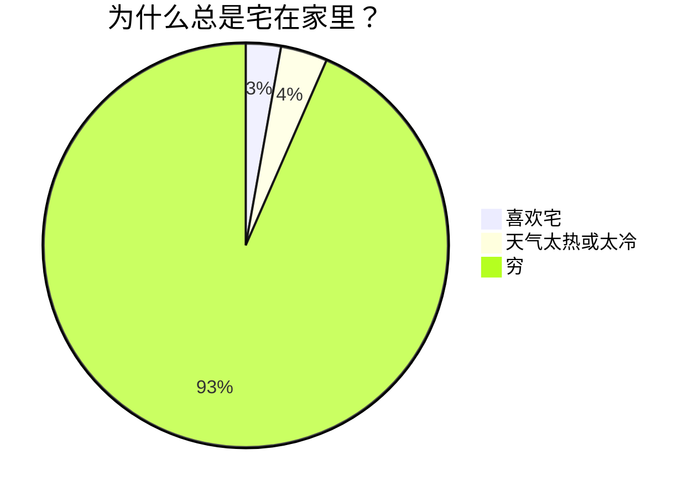

# 饼状图

## 语法

```markdown
pie
  title 标题（可选）
  数据部分
```

### 数据部分

* 在`" "`内写上分区名。
* 分区名后使用`:`作为分隔符。
* 分隔符后写上数值，最多支持`2`位小数——数据会以**百分比**的形式展示。

## 示例

```markdown
pie
  title 为什么总是宅在家里？
  "喜欢宅" : 15
  "天气太热或太冷" : 20
  "穷" : 500
```

效果：


