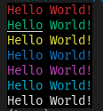
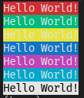

# print 方法输出

## 标准格式

```py
print(f"\033[显示方式;前景颜色;背景颜色{message}\033[0m")
```

## 显示方式

|意义|显示方式|
|-----|-----|
|默认|0|
|高亮显示|1|
|下划线|4|
|闪烁|5|
|反白显示|7|
|不可见|8|

## 前景颜色和背景颜色

|颜色|前景色|背景色|
|-----|-----|-----|
|黑色	|30	|40|
|红色	|31	|41|
|绿色	|32	|42|
|黄色	|33	|43|
|蓝色	|34	|44|
|紫红色	|35	|45|
|青蓝色	|36	|46|
|白色	|37	|47|

::: tip 提示
没有设置的话就是**默认**
:::

## 示例

```py
print("\033[0;31;40mHello World!\033[0m")
print("\033[0;32;40mHello World!\033[0m")
print("\033[0;33;40mHello World!\033[0m")
print("\033[0;34;40mHello World!\033[0m")
print("\033[0;35;40mHello World!\033[0m")
print("\033[0;36;40mHello World!\033[0m")
print("\033[0;37;40mHello World!\033[0m")
```

输出：



```py
print("\033[0;37;41mHello World!\033[0m")
print("\033[0;37;42mHello World!\033[0m")
print("\033[0;37;43mHello World!\033[0m")
print("\033[0;37;44mHello World!\033[0m")
print("\033[0;37;45mHello World!\033[0m")
print("\033[0;37;46mHello World!\033[0m")
print("\033[0;30;47mHello World!\033[0m")
```

输出：


