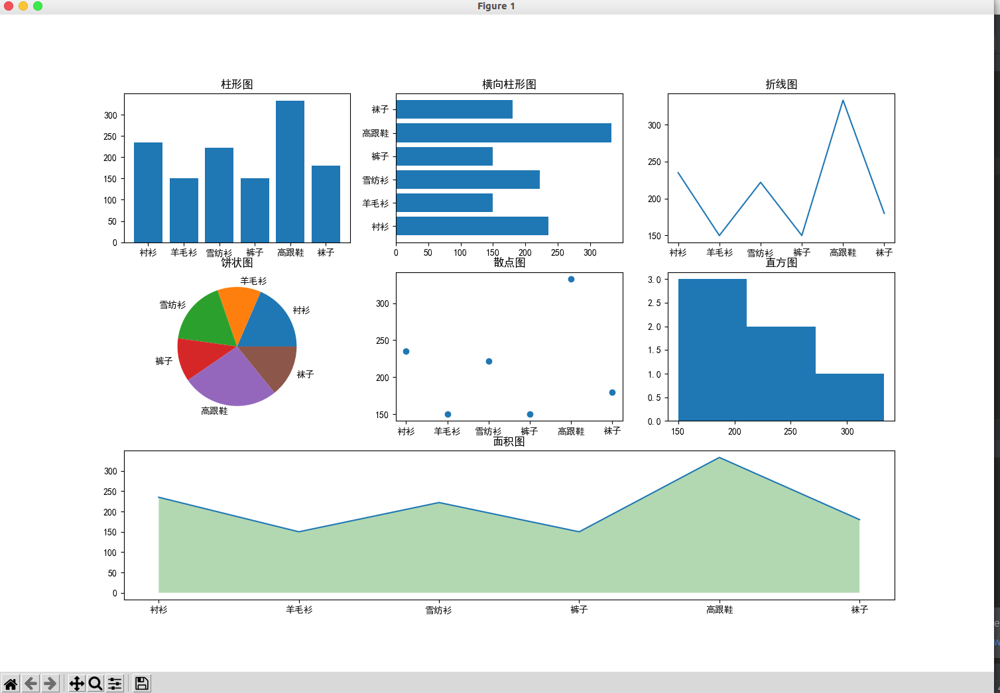

# 多图显示

很多时候需要在一个窗口上显示多张图表，以便于分析。

```py
from matplotlib import pyplot as plt

# 这两行代码使得 pyplot 画出的图形中可以显示中文
plt.rcParams['font.sans-serif'] = ['SimHei']
plt.rcParams['axes.unicode_minus'] = False

x = ['衬衫', '羊毛衫', '雪纺衫', '裤子', '高跟鞋', '袜子']
y = [235, 150, 222, 150, 333, 180]

plt.figure(figsize=(15, 12))  # 设定画布大小

plt.subplot(3, 3, 1)
plt.title('柱形图')
plt.bar(x, y)

plt.subplot(3, 3, 2)
plt.title('横向柱形图')
plt.barh(x, y)

plt.subplot(3, 3, 3)
plt.title('折线图')
plt.plot(x, y)

plt.subplot(3, 3, 4)
plt.title('饼状图')
plt.pie(y, labels=x)

plt.subplot(3, 3, 5)
plt.title('散点图')
plt.scatter(x, y)

plt.subplot(3, 3, 6)
plt.title('直方图')
d = 50  # 组距
num_bins = (max(y) - min(y)) // d
plt.hist(y, num_bins)

plt.subplot(3, 1, 3)
plt.title('面积图')
plt.plot(x, y)
plt.fill_between(
    x,  # 覆盖的区域，表示整个x都覆盖
    0,  # 覆盖的下限
    y,  # 覆盖的上限，是y这个曲线
    facecolor='green',  # 覆盖区域的颜色
    alpha=0.3  # 覆盖区域的透明度[0,1]，其值越小，表示越透明
)

plt.show()
```


