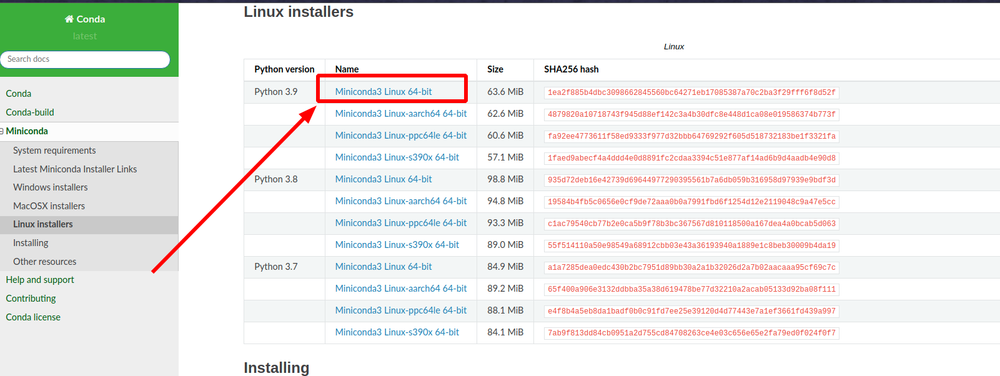

# Ubuntu 20.04 安装

## Step1. 下载安装脚本

[官网下载地址](https://docs.conda.io/en/latest/miniconda.html#linux-installers)，下载如下版本：



## Step2. 安装

运行上一步下载的安装脚本

```bash
# 如果使用zsh终端
$ zsh ./Miniconda3-py39_4.10.3-Linux-x86_64.sh

# 如果使用bash终端
$ bash ./Miniconda3-py39_4.10.3-Linux-x86_64.sh
```

**回车**和 `yes` 看着输就行了。

## Step3. 换源

> [!warning|label:注意]
> 这里千万不要用清华的镜像源，因为它不更新了。。。使用中科大的。


打开终端，输入如下命令：

```bash
$ conda config --add channels https://mirrors.ustc.edu.cn/anaconda/pkgs/free/
$ conda config --set show_channel_urls yes
```