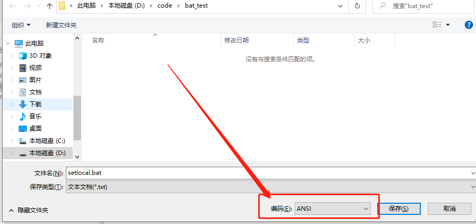

# 中文乱码

很有可能在执行 `bat` 脚本的时候会出现输出中文显示乱码的情况，这种情况一般是由于 `bat` 文件的**编码问题**导致了。 `bat` 文件不能保存为通用的 `utf-8` 格式，保存为 `utf-8` 格式后就会乱码，与我们常见的不一样。

这里介绍两种中文编码支持方式

## 文本保存

如果是以记事本的另存为的方式保存，只需要在编码除选择 `ANSI` 即可。

## vscode

通常会使用编辑器来编辑 `bat` 文件，这样有很好的编程支持，在 `vscode` 中设置编码要选择 `GBK` 编码支持。

