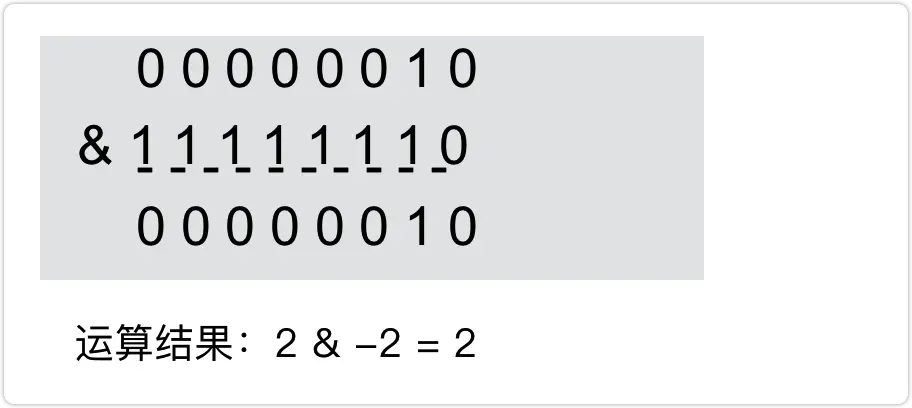
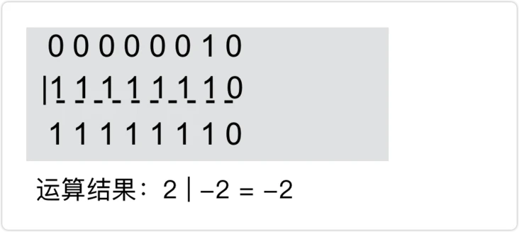
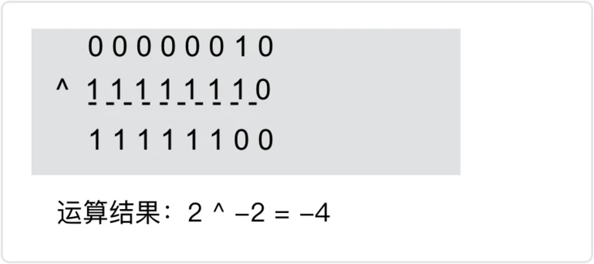
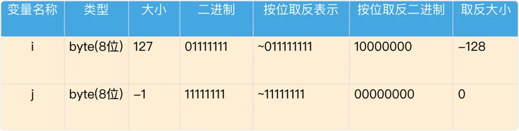

# 位运算

https://segmentfault.com/a/1190000039101602

http://blog.chinaunix.net/uid-21411227-id-1826986.html

## 什么是位运算

程序中的所有数在计算机内存中都是以**二进制**的形式储存的。**位运算**就是直接对整数在内存中的二进制位进行操作。

位运算就是直接操作二进制数，常见的运算符有**与**( `&` )、**或**( `|` )、**异或**( `^` )、**取反**( `~` )、**左移**( `<<` )、**右移**( `>>` 是**带符号右移**`>>>`**无符号右移动**)。下面来细看看每一种位运算的规则。

### 与（&）

规则：二进制对应位两两进行逻辑 `AND` 运算。即：只有对应位的值都是 `1` 时结果才为 `1` , 否则即为 `0` 。

示例： `0&0=0` , `0&1=0` , `1&1=1`

### 或（|）

规则：二进制对应位两两进行**逻辑或**运算。即：对应位中有一个为 `1` 则为 `1` 。

示例： `0|0=0` 、 `0|1=1` 、 `1|1=1`

### 异或（^）

规则：二进制对应位两两进行逻辑 `XOR` (**异或**) 的运算。即：当对应位的值不同时为 `1` , 否则为 `0` 。

示例： `0^0=0` , `0^1=1` , `1^1=0`

### 按位取反（~）

规则：二进制的 `0` 变成 `1` ， `1` 变成 `0` 。

### 移位

1. **左移**（`<<`）：左移后右边位补 `0`
2. **右移**（`>>`）：右移后左边位补**原最左位值**(可能是`0`，可能是`1`)
3. **无符号右移**（`>>>`）：右移后左边位补 `0`

> [!tip|label: 解读]
> 1. 对于**左移**运算符 `<<` 没有悬念右侧填个零无论正负数相当于整个数乘以 `2` 。
> 2. 而**右移**运算符就有分歧了，分别是左侧补0 `>>>` 和左侧补原始位 `>>` ，如果是正数没争议左侧都是补 `0` ，达到除以 `2` 的效果；如果是负数的话左侧补0 `>>>` 那么数值的正负会发生改变，会从一个负数变成一个相对较大的正数。而如果是左侧补原始位(负数补 `1` ) `>>` 那么整个数还是负数，也就是相当于除以 `2` 的效果。

