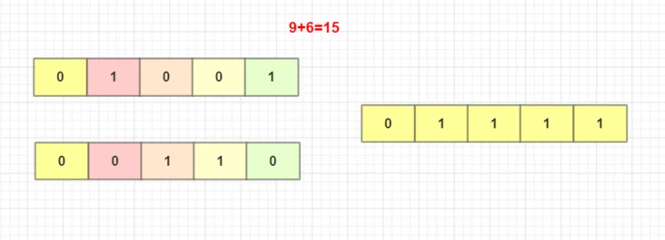
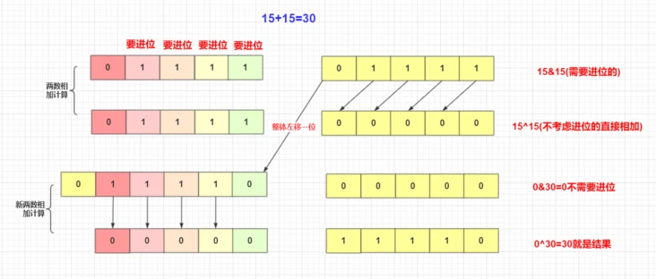

# 不用加减乘除做加法

## 题目描述

写一个函数，求两个整数之和，要求在函数体内不得使用 `+` 、 `-` 、 `*` 、 `/` 四则运算符号。

## 分析

对于加法的一个二进制运算。**如果不进位**那么就是非常容易的。这时候相同位都为 `0` 则为 `0` ， `0` 和 `1` 则为 `1` 。满足这种运算的**异或**(不相同取 `1` ，相同取 `0` )和或(有一个 `1` 则为 `1` )都能满足。



但事实肯定有进位的运算啊！看到上面操作的不足之后，我们肯定还需要**解决进位的问题**对于进位的两数相加，这种**核心思想**为：

1. 用两个数，**一个正常m相加**(不考虑进位的)。用**异或**`a^b`就是满足这种要求，先不考虑进位(如果没进位那么就是最终结果)。另一个**专门考虑进位的n**。两个`1`需要进位。所以我们用`a&b`与记录需要进位的。但是还有个问题，进位的要往上面进位，所以就变成这个需要进位的数**左移**一位。
2. 然后就变成`m+n`重新迭代开始上面直到不需要进位的(即`n=0`时候)。



最终代码实现为：( `Java` 版)

```java
public class Solution {
  public int Add(int num1,int num2) {
    /*
      *  5+3   5^3(0110)   5&3(0001) 
      *  0101    
      *  0011 
      */
    int a = num1 ^ num2;
    int b = num1 & num2;
    b = b << 1;
    if(b==0) return a;
    else {
        return Add(a, b);
    }        
  }
}
```
