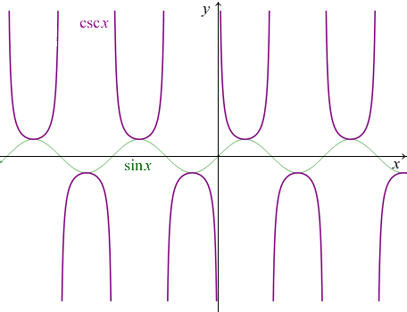

# 图像

参考网址：http://math001.com/inverse_trigonometric_functions/

## 正弦函数 sin x 和反正弦函数 arcsin x

## 余弦函数 cos x 和反余弦函数 arccos x

## 反正弦函数 arcsin x 和反余弦函数 arccos x

* `y = arcsin x` 与 `y = arccos x` 自变量的取值范围都是 `x∈[–1，1]`
* `y = arcsin x` 与 `y = arccos x` 的图像关于直线 $y=\frac{\pi }{4}$ 对称，相交与点 $(\frac{\sqrt{2} }{2}, \frac{\pi }{4})$

## 正切函数 tan x 和余切函数 cot x

* `y = tan x` 与 `y = cot x` 的图像关于 $x = \frac{\pi }{4} + \frac{k\pi }{2}$ 对称
* 在单个周期内（第一个），`y = tan x` 与 `y = cot x` 的图像相交与点 $(\frac{\pi }{4}, 1)$。当 $x = \frac{\pi }{4} + \frac{k\pi }{2}$ 时，`y = tan x` 与 `y = cot x` 函数的值都相等，等于 `±1`

## 反正切函数 arctan x 和反余切函数 arccot x

* `y = arctan x` 与 `y = arccot x` 的图像关于直线 $y=\frac{\pi }{4}$ 对称，相交与点 $(1, \frac{\pi }{4})$

## 余割函数 csc x

## 正割函数 sec x

