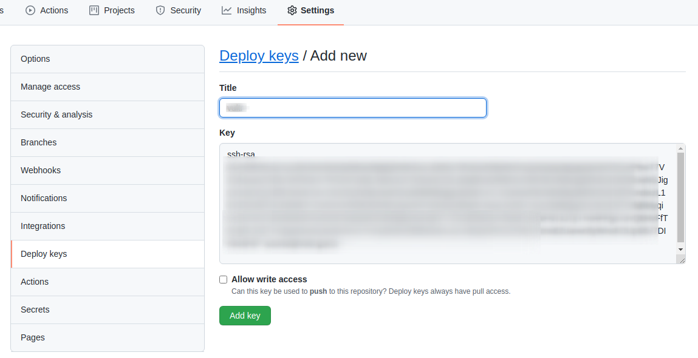
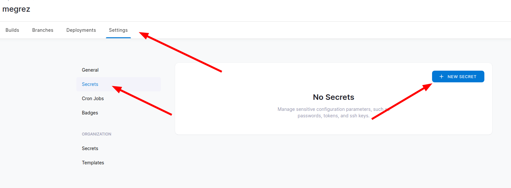
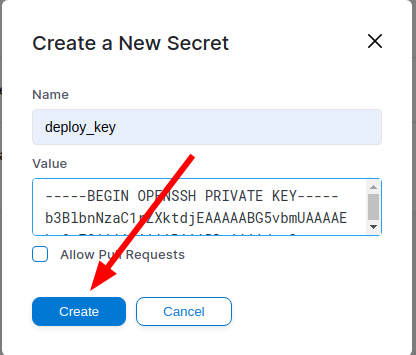

# 接入GitHub私有仓库

`Drone` 默认会有一个 `Clone` 的步骤，要克隆**私有仓库**要把这个步骤关闭，因为他会直接通过公网连接来下载源码，例如： `https://github.com/IricBing/megrez.git` ，对于私有仓库，肯定会下载失败的。

这里面利用两个东西来做，一个是 `GitHub` 仓库的 `Deploy Key` ，一个是 `Drone` 的 `Secrets` ，之后**重写**默认的 `Clone` 步骤。

## GitHub配置Deploy Key

在项目仓库的 `Settings` 配置中，点击左侧菜单栏中的 `Deploy keys` ，然后点击右上角的 `Add deploy key` 按钮，开始**新建**一个 `Deploy key` 。如下所示：


之后输入一个 `Title` 和 `Key` 内容即可，其中 `Key` 内容是 `~/.ssh/id_rsa.pub` 中的内容，即密钥对的**公钥**



## Drone配置Secret

在 `Drone` 管理页面的 `Settings` 界面中，点击左侧的 `Secrets` 菜单，之后点击 `NEW SECRET` 按钮进行新建，如下所示：



接下来填写 `Secret` 的**名称**和**值**即可，其中**值**是 `~/.ssh/id_rsa` 中的内容，即密钥对的**私钥**



## 重写Clone步骤

`drone.yml` 配置文件示例：

```yaml
kind: pipeline
type: docker
name: build

clone:
  disable: true

steps:
  - name: clone
    image: alpine/git
    environment:
      SSH_KEY:
        from_secret: deploy_key
    commands:
      - mkdir -p /root/.ssh/
      - echo "$SSH_KEY" > /root/.ssh/id_rsa
      - chmod -R 600 /root/.ssh/
      - ssh-keyscan -t rsa github.com >> ~/.ssh/known_hosts
      - git clone -v git@github.com:IricBing/megrez.git .
```
