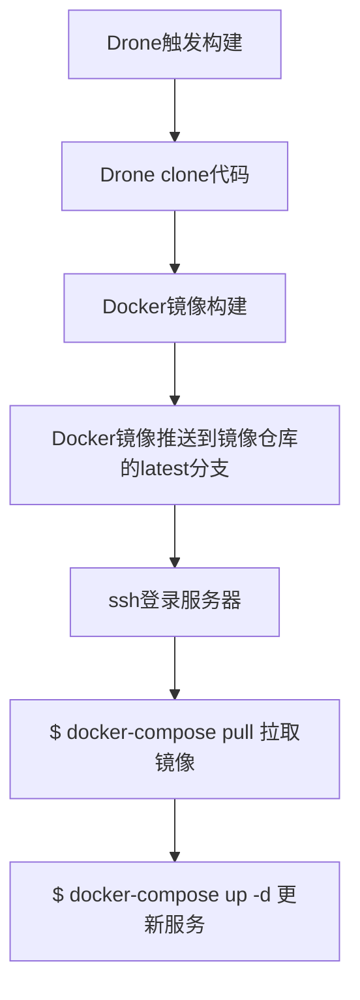

# Docker Compose 部署

## 部署方式

使用 `Docker Compose` 部署一系列相关联的服务，不涉及到多台服务器组成集群。

## 自动部署原理

根据项目部署方式的不同，自动部署的实现方式也是不同的，一般 `Docker Compose` 的服务组配置有两种，一种是部署的时候全部使用一个 `tag` 的镜像（例如： `latest` ），一种是指定 `tag` （例如： `0.0.1` ）。

### 使用固定tag

这个时候就比较简单了， `Drone` 在构建好镜像后推送到镜像仓库时总是往一个 `tag` 上推送，这里用 `latest` 来举例。推送成功后，通过 `ssh pipeline` 登录服务器，指定 `docker-compose pull` 命令， `pull` 完成后执行 `docker-compose up -d` 命令即可完成服务更新部署。

流程如下：

这种构建方式的优点在于每次更新的时候不需要动 `docker-compose.yml` 配置文件，当然，缺点也非常明显，版本**回滚**的时候非常麻烦。

### 使用指定tag

还没研究好，未完待续。。。
