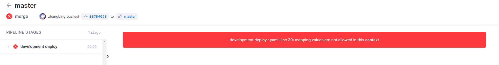

# Docker 镜像缓存

## Step中镜像缓存

```yaml
kind: pipeline
type: docker
name: production deploy

clone:
  disable: true

steps:
  - name: clone & auto tag
    image: alpine/git:v2.32.0
    environment:
      SSH_KEY:
        from_secret: deploy_key
    commands:
    ...

  - name: build
    image: plugins/docker:20.10.9
    settings:
    ...

  - name: deploy
    image: appleboy/drone-ssh:1.6.3
    settings:
      host: xxx.xxx.xxx.xxx
      username: ubuntu
      password:
        from_secret: server_ubuntu_password
      port: 22
      script:
        - cd /home/ubuntu/code && docker-compose pull
        - cd /home/ubuntu/code && docker-compose up -d
        - docker image prune -f
```

## Dockerfile构建缓存

[官方文档](https://docs.drone.io/pipeline/docker/examples/services/docker/)

> [!note]
> 这里需要使用 `Drone` 的管理员账户，如果 `Drone` 初始化的时候没有管理员账号，要重新装。

首先要在 `Drone` 中开启这个项目的 `Trusted` 配置，因为使用外部 `Docker` 是一件非常有**风险**的事情，因此 `Drone` 设置为只允许**受信任**的应用访问外部 `Docker` 。


```yaml
  - name: build
    image: docker:dind
    volumes:
      - name: dockersock
        path: /var/run/docker.sock
    commands:
      - docker ps -a
      - docker build --no-cache -t ip2region .

volumes:
- name: dockersock
  host:
    path: /var/run/docker.sock
```

### 采坑

如果想在宿主机的 `Docker` 中使用 `Drone` 的变量，需要特殊处理，因为 `docker:dind` 的 `commands` 有格式问题，正常情况下使用如下的配置即可：

```yaml
  - name: build
    image: docker:dind
    volumes:
      - name: dockersock
        path: /var/run/docker.sock
    commands:
      - docker build --no-cache -t dawen-master:${DRONE_TAG##v} .
      - docker tag dawen-master:${DRONE_TAG##v} registry.cn-hangzhou.aliyuncs.com/9xing/dawen-master:${DRONE_TAG##v}
      - docker push registry.cn-hangzhou.aliyuncs.com/9xing/dawen-master:${DRONE_TAG##v}
      - docker tag registry.cn-hangzhou.aliyuncs.com/9xing/dawen-master:${DRONE_TAG##v} registry.cn-hangzhou.aliyuncs.com/9xing/dawen-master:latest
      - docker push registry.cn-hangzhou.aliyuncs.com/9xing/dawen-master:latest
```

但是，这种配置虽然没有语法上的问题，可 `Drone` 却说配置格式不正确！如下所示：



个人认为这个是 `Drone` 的一个 `Bug` ，但是该用还是得使用，采用 `echo` 的方式来临时解决，相信未来可以不用这么麻烦，笔记记录时间：**2022年1月4日**。

```yaml
  - name: build
    image: docker:dind
    volumes:
      - name: dockersock
        path: /var/run/docker.sock
    commands:
      - docker build --no-cache -t dawen-master:`echo ${DRONE_TAG##v}` .
      - docker tag dawen-master:`echo ${DRONE_TAG##v}` registry.cn-hangzhou.aliyuncs.com/9xing/dawen-master:`echo ${DRONE_TAG##v}`
      - docker push registry.cn-hangzhou.aliyuncs.com/9xing/dawen-master:`echo ${DRONE_TAG##v}`
      - docker tag registry.cn-hangzhou.aliyuncs.com/9xing/dawen-master:`echo ${DRONE_TAG##v}` registry.cn-hangzhou.aliyuncs.com/9xing/dawen-master:latest
      - docker push registry.cn-hangzhou.aliyuncs.com/9xing/dawen-master:latest
```
