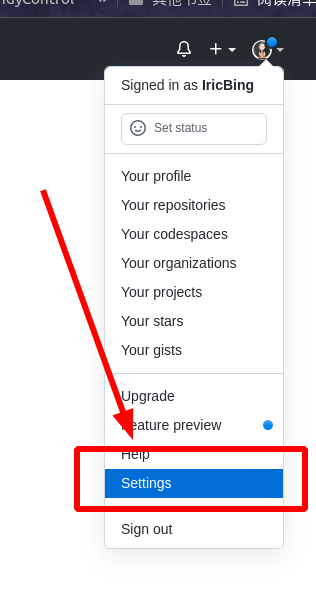
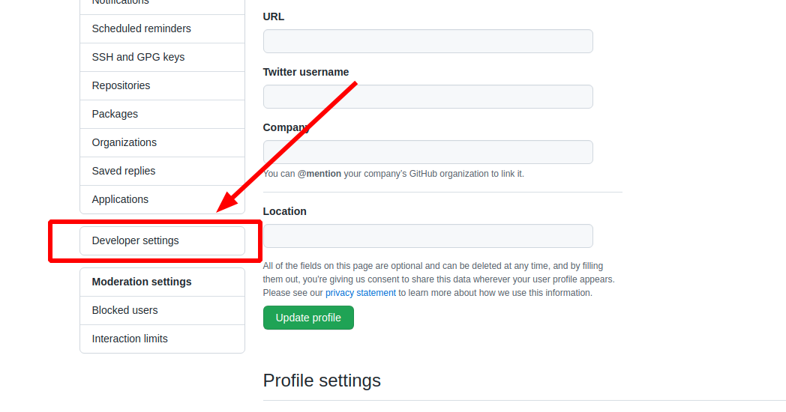
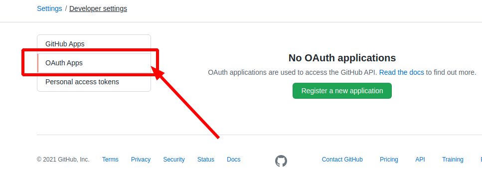
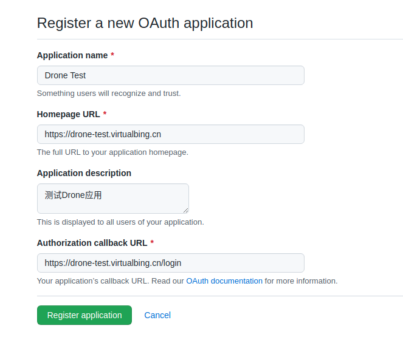
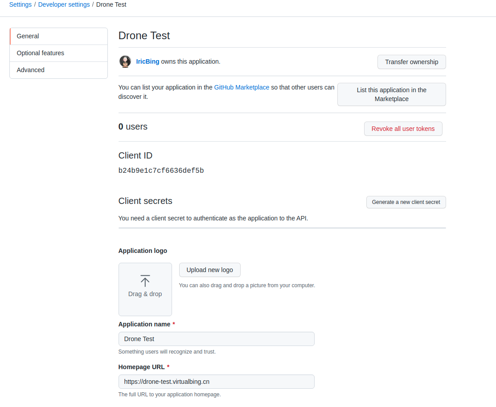

# Github

## Step1. 创建OAuth应用

关于创建 `OAuth` 应用的[GitHub官方文档](https://docs.github.com/cn/developers/apps/building-oauth-apps/creating-an-oauth-app)

首先登录 `GitHub` ，之后在**个人头像**上点击，选择 `Settings` ，进入设置页面，如下所示：



之后在左侧菜单栏中点击 `Developer settings` 菜单，进入开发设置页面。



接下来就能看到 `OAuth` 应用了，如下所示：



接下来**新建**一个 `OAuth` 应用，如下所示：



点击 `Register Application` 按钮之后就创建完成了，如下所示：



默认是没有客户端密钥的，需要先生成一个，点击 `Generate a new client secret` 按钮即可，如下所示：


## Step2. 创建共享秘钥

**共享秘钥**用于 `Drone` 服务和 `runners` 服务之间的通信认证。可以利用 `openssl` 来生成这个秘钥，如下所示：

```bash
$ openssl rand -hex 16
bea26a2221fd8090ea38720fc445eca6
```

> [!tip|label:提示]
> 每次运行这个命令都会**随机**生成一个秘钥，**这个秘钥不会保存，记得自己保存哦**！

## Step3. 运行Drone Sever

这里采用`Docker`运行，直接在命令中写入即可，如下所示：

```bash
$ docker run \
  --volume=/var/lib/drone:/data \
  --env=DRONE_GITHUB_CLIENT_ID=OAuth ID \
  --env=DRONE_GITHUB_CLIENT_SECRET=OAuth Secret \
  --env=DRONE_RPC_SECRET=共享密钥 \
  --env=DRONE_SERVER_HOST=drone.company.com \
  --env=DRONE_SERVER_PROTO=https \
  --env=DRONE_USER_CREATE=username:iricbing,admin:true \
  --publish=80:80 \
  --publish=443:443 \
  --restart=always \
  --detach=true \
  --name=drone \
  drone/drone:2
```

> [!warning]
> 记得注意端口映射和设置管理员用户。
