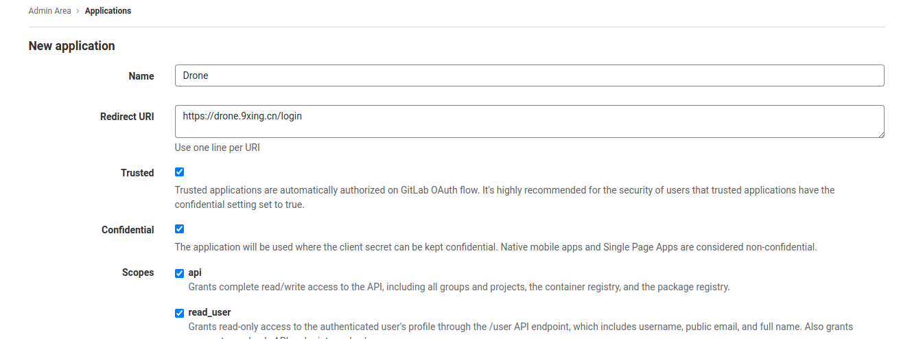
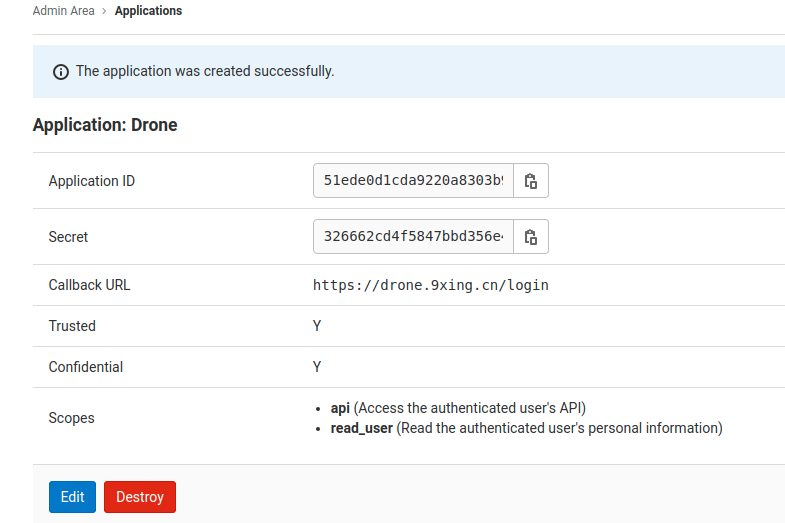

# GitLab

关于接入 `GitLab` 的[官方文档](https://docs.drone.io/server/provider/gitlab/)

## Step1. 创建OAuth应用

首先以**管理员账号**登录，进入管理员菜单，在左侧选择 `Application` ，之后点击 `New application` 按钮进行创建 `OAuth` 应用。



**勾选**全部配置项， `Redirect URI` 为 `Drone` 的登录页面地址。点击 `Submit` 之后会显示创建好的 `OAuth` 应用应用信息，如下所示：



其中的 `Application ID` 和 `Secret` 要**保存**下来，因为**一旦关闭了这个页面就再也看不到了！**

## Step2. 创建共享秘钥

**共享秘钥**用于 `Drone` 服务和 `runners` 服务之间的通信认证。可以利用 `openssl` 来生成这个秘钥，如下所示：

```bash
$ openssl rand -hex 16
bea26a2221fd8090ea38720fc445eca6
```

::: tip 提示
每次运行这个命令都会**随机**生成一个秘钥，**这个秘钥不会保存，记得自己保存哦**！
:::
## Step3. 运行Drone Sever

这里采用`Docker`运行，直接在命令中写入即可，如下所示：

```bash {3-10}
$ docker run \
  --volume=/var/lib/drone:/data \
  --env=DRONE_GITLAB_SERVER=Gitlab地址 \
  --env=DRONE_GITLAB_CLIENT_ID=OAuth ID \
  --env=DRONE_GITLAB_CLIENT_SECRET=OAuth Secret \
  --env=DRONE_RPC_SECRET=共享密钥 \
  --env=DRONE_SERVER_HOST=drone.company.com \
  --env=DRONE_SERVER_PROTO=https \
  --env=DRONE_USER_CREATE=username:zhangbing,admin:true \
  --publish=80:80 \
  --publish=443:443 \
  --restart=always \
  --detach=true \
  --name=drone \
  drone/drone:2
```

> [!warning]
> 记得注意端口映射和设置管理员用户。
