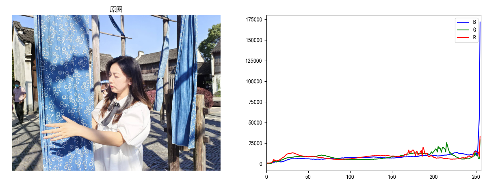

# 颜色直方图

## 示例代码

```py
import cv2
import numpy as np
from PIL import Image
from matplotlib import pyplot as plt

# 这两行代码使得 pyplot 画出的图形中可以显示中文
plt.rcParams['font.sans-serif'] = ['SimHei']
plt.rcParams['axes.unicode_minus'] = False

pic_file = 'demo.jpeg'

fig = plt.gcf()
fig.set_size_inches(15, 5)

plt.subplot(1, 2, 1)
plt.imshow(Image.open(pic_file))
plt.axis('off')
plt.title('原图')

# 按R、G、B三个通道分别计算颜色直方图
img_bgr = cv2.imread(pic_file, cv2.IMREAD_COLOR)  # OpenCV读取颜色顺序：BGR
b_hist = cv2.calcHist([img_bgr], [0], None, [256], [0, 256])
g_hist = cv2.calcHist([img_bgr], [1], None, [256], [0, 256])
r_hist = cv2.calcHist([img_bgr], [2], None, [256], [0, 256])

# 显示3个通道的颜色直方图
plt.subplot(1, 2, 2)
plt.plot(b_hist, label='B', color='blue')
plt.plot(g_hist, label='G', color='green')
plt.plot(r_hist, label='R', color='red')
plt.legend(loc='best')
plt.xlim([0, 256])
plt.show()
```

效果：


