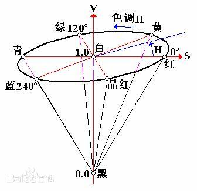
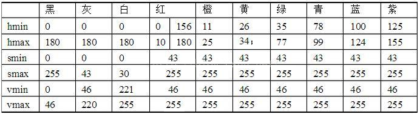
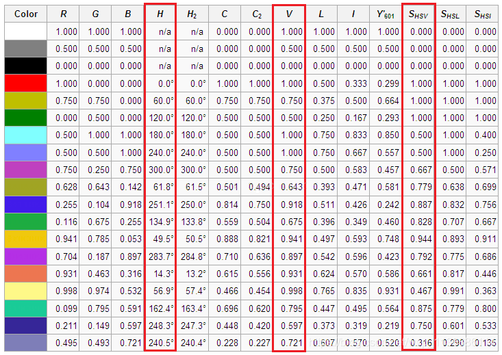
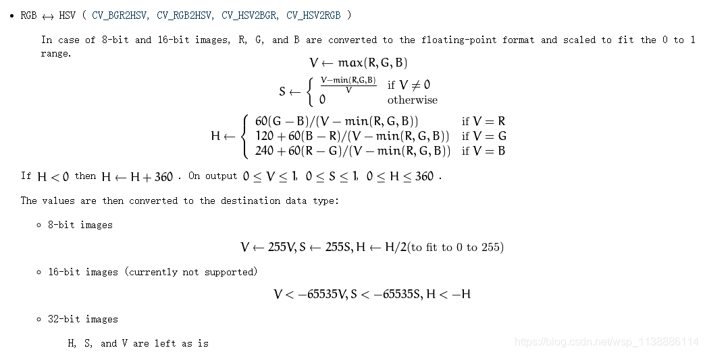

# HSV颜色模型

## 定义

`HSV` (Hue, Saturation, Value)是根据颜色的直观特性由 `A. R. Smith` 在1978年创建的一种颜色空间, 也称**六角锥体模型**( `Hexcone Model` )。

这个模型中颜色的参数分别是：**色调**（ `H` ），**饱和度**（ `S` ），**明度**（ `V` ）。

## 颜色模型

### 色调H

用**角度**度量，取值范围为 `0°～360°` ，从**红色**开始按**逆时针**方向计算，**红色**为 `0°` ，**绿色**为 `120°` , **蓝色**为 `240°` 。它们的**补色**是：**黄色**为 `60°` ，**青色**为 `180°` , **紫色**为 `300°` ；

### 饱和度S

**饱和度S**表示颜色**接近光谱色的程度**。一种颜色，可以看成是某种光谱色与白色混合的结果。其中**光谱色所占的比例愈大，颜色接近光谱色的程度就愈高，颜色的饱和度也就愈高**。饱和度高，颜色则**深而艳**。光谱色的**白光**成分为 `0` ，饱和度达到**最高**。通常取值范围为 `0%～100%` ，**值越大，颜色越饱和**。

### 明度V

**明度**表示颜色**明亮的程度**，对于**光源色**，明度值与发光体的**光亮度**有关；对于**物体色**，此值和物体的**透射比**或**反射比**有关。通常取值范围为 `0%` （**黑**）到 `100%` （**白**）。

## 六棱锥

`RGB` 和 `CMY` 颜色模型都是面向**硬件**的，而 `HSV` 颜色模型是面向**用户**的。

`HSV` 模型的三维表示从 `RGB立方体` 演化而来。设想从 `RGB` 沿**立方体对角线**的白色顶点向黑色顶点观察，就可以看到立方体的六边形外形。六边形边界表示色彩，水平轴表示纯度，明度沿垂直轴测量。

## 颜色库

十色范围定义：

`hsv` 颜色库：

## 算法

### RGB转HSV

原理：

### HSV转RGB
